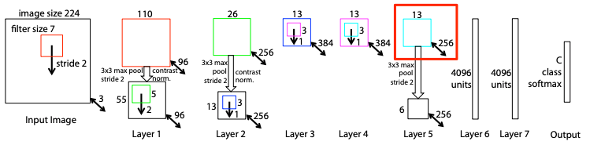

Faster R-CNN 是由 object detection 的大神 [***Ross Girshick***](https://www.rossgirshick.info/) 於 2015 年所提出的一個非常經典的目標檢測(object detection)的方法，當中提出了 **Region Proposal Networks** 的方法應用在提取候選區域(reigon proposals) 取代了傳統的 Selective Search 的方式，大幅提升了目標檢測的精準度，也提升了整體計算的速度，另外 [***Kaiming He***](http://kaiminghe.com/) 博士也是共同作者。

在介紹 Faster R-CNN 之前需要先了解何為 one stage 與 two stage，目前 object detection 的主流都是以 one stage 為基礎的演算法，建議可以參考下列兩篇很棒的文章:

1. [什麼是one stage，什麼是two stage 物件偵測](https://medium.com/@chih.sheng.huang821/%E6%B7%B1%E5%BA%A6%E5%AD%B8%E7%BF%92-%E4%BB%80%E9%BA%BC%E6%98%AFone-stage-%E4%BB%80%E9%BA%BC%E6%98%AFtwo-stage-%E7%89%A9%E4%BB%B6%E5%81%B5%E6%B8%AC-fc3ce505390f>)
2. [物件偵測上的模型結構變化](<https://medium.com/@chih.sheng.huang821/%E6%B7%B1%E5%BA%A6%E5%AD%B8%E7%BF%92-%E7%89%A9%E4%BB%B6%E5%81%B5%E6%B8%AC%E4%B8%8A%E7%9A%84%E6%A8%A1%E5%9E%8B%E7%B5%90%E6%A7%8B%E8%AE%8A%E5%8C%96-e23fd928ee59>)

Faster R-CNN 主要是由四個部分來完成:

1. Feature Extractor
2. Region Proposal Network (RPN)
3. Regoin Proposal Filter
4. ROI Pooling

下圖為 Faster R-CNN 的簡易架構圖:

<figure>
	

  <figcaption>
Image credit: original paper
</figcaption>
</figure>

下圖是我參考了許多相關的部落格文章後，覺得在呈現 Faster R-CNN 的架構上最容易讓人了解的一張圖，可以搭配著上圖來對照一下！

<figure>
	

  <figcaption>
Image credit: https://zhuanlan.zhihu.com/p/44599606
</figcaption>
</figure>

## 1. Feature Extractor

透過五層的 conv layer 來取得 feature maps，作為後續的共享的 input。 作者採用了 **ZF Net** 以及 **VGG-16** 為主，依據 input size 的不同，最後 feature maps 的 W x H 也有所不同，但 channel 數是相同的。

**ZF Net 取第五層的 Feature maps，output 為 13 x 13 x 256**

**VGG-16 取第五層的 Feature maps，output 為 7 x 7 x 256**

## 2. Region Proposal Networks

在解析 RPN 的內容前，先來談談 RPN 與 Anchors 之所會被提出來，是來解決什麼樣的問題。

**簡略說明兩個方法面向的問題:**

**RPN** 主要的目的是為了產生只具有 foreground 的候選區域(region proposals)， 所以在 RPN 的輸出會有所謂的 foreground 與 background 的分類機率(此處的foreground 與 background 可以理解成是否含有 objects )。相較原本 Selective Search 用比較相鄰區域的相似度(顏色, 紋理, …等)合併再一起的方式，加快了運算的速度，同時也加強了物件檢測的精準度。

**Anchors** 主要的目的是要來解決由於圖片大小不同，所以導致每張圖片在最後要將結果還原成原圖的座標時，會產生複雜的計算。固定 bounding boxes 的大小，可以加快計算的效率，也可以減少過多不必要的後選區域的產生。

接下來進入 RPN 生成 region proposals 的解析:

<figure>
	

  <figcaption>
Image credit: original paper
</figcaption>
</figure>

1. 對最後一層 conv layer 的 feature maps 用一個 n x n 的 spatial window 做 sliding window (stride=1, pad=1)，在論文中 **n=3** 是因為對於較大的圖片在計算上比較有效率。此處可以將 sliding windows 這個過程想成是做一個 convolution 的過程來理解，output 則會是 ( feature map width, feature map height, channel )。

2. Sliding windows 的結果 mapping 到 lower-dimensional feature，此處將帶入關鍵的 **anchors**。

   **Anchors** 是事先設定好的多組 bounding boxes，設定的組成是透過 image 對於 **scale** 與 **aspect ratio** 的參數設定來決定的。如下圖的右圖，論文中選擇 3 個 scale x 3 個 aspect ratio，所以共產生 9 個 archors。

   - scale: the size of image, ex: $(128^2, 256^2, 512^2)$
   - aspect ratio: width of image / height of image, ex: (1:1, 1:2, 2:1) 

   表示在對 feature maps 進行 sliding windows 時，每個 sliding windows 對應原圖區域中的 9 個anchors，而 sliding windows 的中心點就對應 anchors 的中心點位置，藉由中心點與圖片的大小，就可以得到 sliding windows 的位置和原圖位置的映射關係(這邊可以用 receptive field 來理解)，就可以由原圖的位置與 ground truth 計算 [**Intersection over Union(IOU)**](https://www.pyimagesearch.com/2016/11/07/intersection-over-union-iou-for-object-detection/)，並且判斷是否有 objects。

   下面左圖示的紅點就是表示每個 sliding window 的中心點對應原圖的位置，而右圖是在表示 9 種不同大小的 anchor 在原圖的呈現。

<figure>
	 
  <figcaption>
Image credit: https://tryolabs.com/blog/2018/01/18/faster-r-cnn-down-the-rabbit-hole-of-modern-object-detection/
</figcaption>
</figure>

下圖呈現出當 9 個不同 anchor 映射到 sliding windows 的中心點，在原圖上的呈現，由這樣的步驟可以理解這 9 個 anchor 剛好足夠可以框出圖片上的所有 object。這邊要注意，如果 anchor boxes 超出原圖的邊框就要被忽略掉。

<figure>
	

  <figcaption>
Image credit: https://tryolabs.com/blog/2018/01/18/faster-r-cnn-down-the-rabbit-hole-of-modern-object-detection/
</figcaption>
</figure>

3. 在上圖可以看到，每個 sliding windows 映射到原圖，原圖上每個 sliding windows 的中心點對應 9 個 anchors，所以將 intermediate layer 所得到的 features 輸入給 兩個 sliding fully-connected layers。

     1. box-regression layer (reg layer): 輸出 4 x k個 boxes 的 encoding 座標值。
     2. box-classification layer (cls layer): 輸出 2 x k 個關於 forground / background 的機率

此方法有效的原因:

* The anchors 與 ground truth 的 intersection-over-union (IOU) 重疊率很高
* IOU > 0.7 為 positive，IOU < 0.3 為 negative，介於 0.7 >= IOU >= 0.3 則忽略，期望 positive 的 proposal 包含前景的機率高，negative 包含背景的機率高。

 Faster R-CNN 的缺點:

1. 在單一 scale 的 feature map 做 object localization and Classification，而且還是 scale=1/32 下，在小物件偵測效果相對不佳，有可能在down-scale時小物件的特徵就消失了

# Reference
1. https://tryolabs.com/blog/2018/01/18/faster-r-cnn-down-the-rabbit-hole-of-modern-object-detection/
2. <https://medium.com/@tanaykarmarkar/region-proposal-network-rpn-backbone-of-faster-r-cnn-4a744a38d7f9>
3. <https://blog.csdn.net/baderange/article/details/79643478>
4. <https://blog.csdn.net/lanran2/article/details/54376126>

 