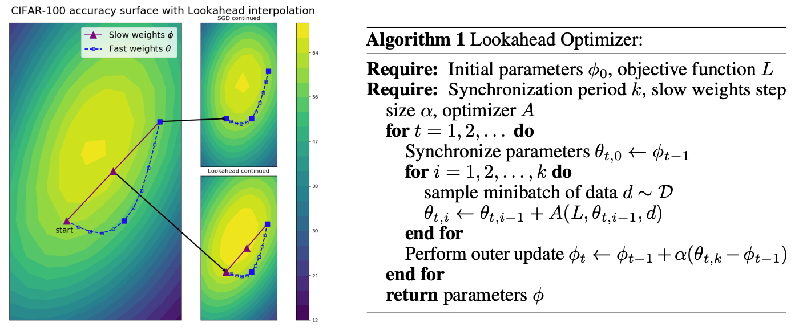
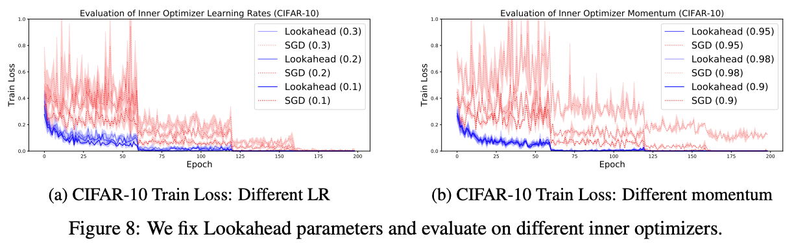
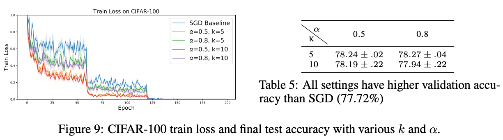
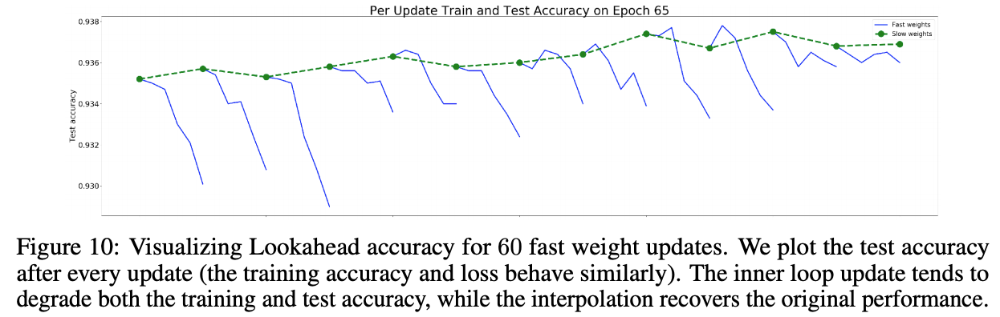

## Introduction

在目前的 optimizer 分為兩個主要發展方向：

1. Adaptive learning rate, such as AdaGrad and Adam
2. Accelerated schema (momentum), such as Polyak heavyball and Nesterov momentum 

以上都是透過累積過往梯度下降所得到的結果來達到收斂，然而要獲得好的結果，都需要一些超參數的調整。

Lookahead method：

1. 是一種新的優化方法，採用兩個不同的權重，分別為 fast weights 與 slow weights。fast weights 是使用一般常見的 optimizer 當作 inner optimizer 先進行 `k` 次的計算後得到的結果與預先保留的 slow weights 進行線性插值(linearly interpolating)來更新權重 ，更新後的 wieight 為新的 slow weights 並推動之前的 fast weights 往前探索，以這樣的方式進行迭代。

2. 在使用不同的 inner optimizer 下，像是 SGD 或是 Adam，減少了對超參數調整的需求，並且可以以最小的計算需求確保在不同的深度學習任務中加快收斂速度。

演算過程 :

Step 1 : 先設定 $\phi$ 的初始值，以及選定 objective function $L$ \\
Step 2 : 確定更新週期 $k$ 值、slow weight 的更新步伐 $\alpha $ 以及 optimizer $A$ \\
Step 3 : 更新 fast weight $\theta$ ，$ \space \theta_{t,0} \leftarrow \phi_{t-1}, t=1,2,\dots $ \\
Step 4 : 利用 optimizer $A$ 迭代 $k$ 次更新，由 $\theta_{t, i}$ 更新到 $\theta_{t, k}, i=1, 2, \dots, k$ \\
Step 5 : 更新 slow weight $\phi_{k} \leftarrow \phi_{k-1} + \alpha\left(\theta_{t, k} - \phi_{t-1}\right)$ \\
重複 Step 3 - Step 5 直至收斂。

其可以想像身處在山脈的頂端，而周邊都是山頭林立，有高有低，其中一座山可通往山腳下，其他都只是在山中繞來繞去，無法走下山。如果親自探索是非常困難，因為在選定一條路線的同時，必須要放棄其他路線，直到最終找到正確的通路，但是如果我們在山頂留下一位夥伴，在其狀況看起來不妙時及時把我們叫回，這樣能幫助我們在尋找出路的時候得到快速的進展，因此全部地形的探索速度將更快，而發生迷路的狀況也更低。

## Method

如同 Algorithm 1 所表示的內循環(inner loop)的 optimizer A 在迭代 $k$ 次後，在 weight space 中，slow weights 的更新為與 fast weights k的線性插值(linearly interpolating)，$\theta - \phi$. 我們將 slow weights learning rate 表示為 $\alpha$, 在 slow weights 更新後，fast weights 會重新設定為 slow weights 的位置。

Standard optimization method typically require carefully tuned learning rate to prevent **oscillation** and **slow converagence**. However, lookahead benefits from a larger learning rate in the inner loop. When oscillation in  the high curvature direction, the fast weights updates make rapid progress along the low curvature direction. The slow weights help smooth out the oscillation throught the parameter interpolation.

**Slow weights trajectory** We can characterize the trajectory of the slow weights as an exponential moving average (EMA) of the final fast weights within each inner-loop, regardless of the inner optimizer. After k inner-loop steps we have:

$$
\begin{align}
\phi_{t+1} &= \phi_{t} + \alpha\left(\theta_{t, k} - \phi_{t}\right) \\
&= \left(1-\alpha\right)\phi_{t} + \alpha\theta_{t, k} \\
&= \left(1-\alpha\right)\left(\phi_{t-1} + \alpha\left(\theta_{t-1, k} - \phi_{t-1}\right) \right) +  \alpha\theta_{t, k} \\
& \vdots \\
&= \alpha\left[\theta_{t, k} + (1 - \alpha)\theta_{t-1, k} + \dots + (1 - \alpha)^{t-1}\theta_{0, k} \right]  + (1- \alpha)^{t}\theta_{0}
\end{align}
$$

**Fast weights trajectory** Within each inner-loop, the trajectory of the fast weight depends on the choice of underlying optimizer. Given an optimization algorithm A that takes in an objective function $L$ and the current mini-batch training examples $d$, we have the update rule for the fast weights:
$$
\theta_{t, i+1} = \theta_{t, i} + A\left(L, \theta_{t, i-1}, d\right)
$$

We have the choice of maintaining, interpolating, or resetting the internal state (e.g. momentum) of the inner optimizer. Every choice improves convergence of the inner optimizer.

**Computational complexity** Lookahead has a constant computational overhead due to parameter copying and basic arithmetic operations that is amortized across the k inner loop updates. The number of operations is $O\left(\frac{k+1}{k}\right)$ times that of the inner optimizer. Lookahead maintains a single additional copy of the number of learnable parameters in the model.

## Empirical Analysis

**Robustness to inner optimization algorithm $k$ and $\alpha$** 在論文中使用 **CIFAR** 的資料測試，Lookahead 能夠在不同的超參數設定下保有快速收斂的結果。在實驗中固定 slow weight step size $\alpha = 0.5$ 與 $k=5$，inner optimizer 選擇使用 SGD optimizer，測試不同的 learning rate 與 momentum 參數，結果顯示如下:

同時實驗了在超參數固定的狀況下，inner optimizer 的 fast weights 在歷經不同 $k$ 與 $\alpha$ 的設定，結果如下圖:

**Inner loop and outer loop evalation** 為了更了解 Lookahead 的在 fast weights 與 slow weights 的更新狀況，透過 test accuracy 的結果來了解 weights 變化的趨勢。如下圖，在每次 inner loop 更新 fast weights 的情況下，對 test accuracy 造成大幅的下降，反映了在每次 inner loop 的更新都具有 high variance 的情況產生。然而，在 slow weights 的更新階段，降低了 variance 的影響，並且慢慢調整 test accuracy 的準確度。

## Code implement

1. https://github.com/bojone/keras_lookahead

2. https://github.com/lifeiteng/Optimizers

## Reference

1. [Lookahead Optimizer: k steps forward, 1 step back](https://arxiv.org/pdf/1907.08610v1.pdf)
2. https://www.infoq.cn/article/Q7gBMEHNrd2rkjqV6CM3?utm_source=rss&utm_medium=article
3. https://www.infoq.cn/article/Q7gBMEHNrd2rkjqV6CM3