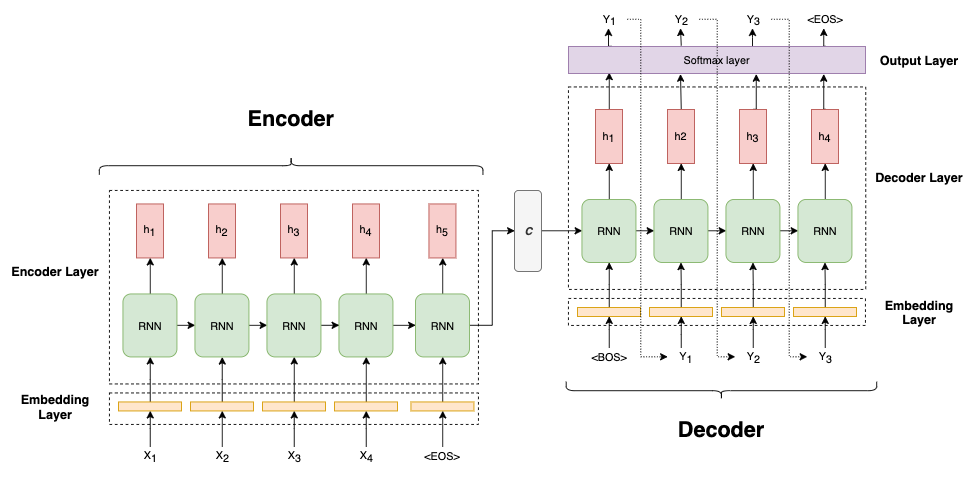
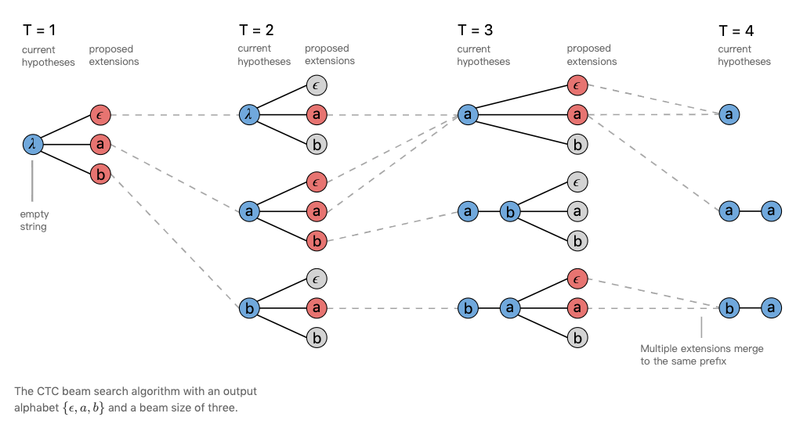
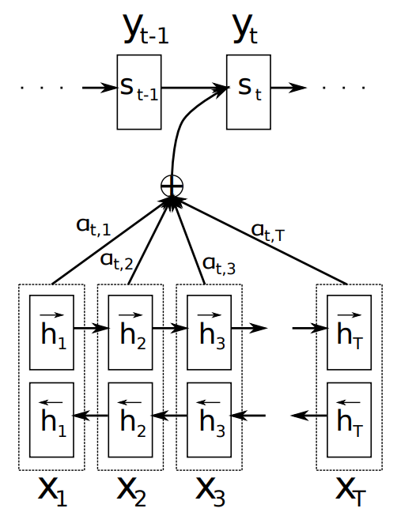

一開始接觸 `Attention Is All You Need` 這篇論文是從 [Kaggle Reading Group](https://www.youtube.com/playlist?list=PLqFaTIg4myu8t5ycqvp7I07jTjol3RCl9) 這個 channel 開始，非常推薦可以跟著一起讀!!

主持人 [Rachael Atman](https://www.kaggle.com/rtatman) 本身是 Kaggle 的 Data Scientist，她的導讀我覺得是流暢的，但她自己本身有說過並非是 NLP 領域的專家，所以在 kaggle reading group 裡閱讀的論文也有可能是她完全沒接觸過的，整個 channel 帶給你的就是一個啟發，讓你覺得有人跟你一起閱讀的感覺，然後過程中也些人會在 channel 的 chat room 提出一些看法或是連結，Rachael 本身也會提出自己的見解，可以多方面參考。

在跟完整個 `Attention Is All You Need` 的影片後，還是有太多細節是不清楚的，因為自己本身也不是這個領域的，所以開始追論文中所提到的一些關鍵名詞，就開始從 $seq2seq \rightarrow attention \rightarrow self-attention$。這中間 有太多知識需要記錄下來，所以將論文的內容分成三部曲，來記錄閱讀下來的點點滴滴:

* Part 1: Attention 與 Self-attention 的理解
* Part 2: Transformer 的架構探討
* Part 3: Attention Is All You Need 實作

# Attention

要說起 attention 就必須從 seq2seq 講起，seq2seq 全名為 Sequence to Sequence[1]，是一個 Encoder - Decoder 架構的模型，在 2014 年被提出，被廣泛的應用於 Machine Translation, Text Summarization, Conversational Modeling, Image Captioning, and more.

### Seq2Seq model

#### Introduction
簡單來說，期望輸入一串序列(source)，輸出一串序列(target)，而這個 source 與 target 可以是什麼呢？

* 如果以 machine translation 來說，任務是中翻英，輸入是一句中文，而輸出則會是一句英文。

* 如果是 text summarization，輸入則會是一段文章，而輸出則會是一段摘要

這就是 seq2seq model 所要解決的問題，在輸入一些資訊後，經過 encoder-decoder 的訓練，可以得到相對應的回答或是其他資訊。

#### Model

模型的架構也非常簡單，就如下圖所示：

<figure class="image">

  
  <figcaption>圖一</figcaption>

</figure>

假設今天我們執行中翻英的任務，輸入(source: X)是一句中文，可以是 "我愛機器學習"，而輸出(target: Y)則會是 "I love machine learning"，所以整個訓練的步驟如下：

1. Input sequence $(x_1, x_2, x_3, \dots, x_s)$  經過 embedding layer 的轉換，得到每個 word 的 embedding vector

2. Encoder 把所有輸入序列 embedding vector 消化後，將資訊壓縮轉換為一個向量 $C$，稱之為 context vector
  
   $$
   \begin{align}
   h_s^{e} & = f_{enc}\left(h_{s-1}^{e}, e_{x_{s-1}}, W_{enc}\right) \\
   C & = h_s^e \text {，最後一步的 hidden state} \\
   C & = q(h_s^e) \text {，最後一步的 hidden state 做 transform } \\
   C & = q\left(h_1^e, h_2^e, \dots, h_s^e\right) \text {，每一步的 hidden state 做 transform }
   \end{align}
   $$
   
   其中 $f_{enc}(\cdot)$ 表示 Encoder 中的 RNN function，參數為 $W_{enc}$。$e_{x_s}$ 表示 $x_s$ 的 embedding vector，$h_s^e$ 表示在時間 $s$ 的 hidden state，$C$ 可以表示為 Encoder 最後的 hidden state 或是經過函數 $q(\cdot)$ 的轉換。

3. Decoder 則根據 context vector 的資訊來生成文字，output sequence $(y_1, y_2, y_3, \dots, y_t)$

   $$
   \begin{align}
   h_0^{d} & = C \\
   h_{t}^{d} & = f_{dec}\left(h_{t-1}^{d}, e_{y_{t-1}}, W_{dec}\right) \\
   O_{t} & = g\left(h_t^d\right)
   \end{align}
   $$

   其中 $h_{0}^{d}$ 為 context vector 傳進來當作 Decoder 的初始 hidden state，$f_{dec}(\cdot)$ 表示 Decoder 中的 RNN function，參數為 $W_{dec}$。$h_{t}^{d}$ 表示 Decoder在時間 $t$ 的 hidden state，$e_{y_{t}}$ 表示前一步的所得到的 $y_{t-1}$ 結果當作輸入，$y_0$ 都是以特殊索引 \<BOS\> 當作輸入。
   $g(\cdot)$ 為 output layer，一般都是 softmax function。

過程就只是簡單的三個步驟，雖然看起來簡單，但當中有些細節是需要注意的。

#### Training

* 特殊索引

    在每個句子做 one-hot-encoder 的轉換時，會在句子的前後加上 \<BOS\> 與 \<EOS\>

  * BOS: Begin of sequence，在預測的時候我們並沒有對應的答案，所以會先以 \<BOS\> 當作 $Y_0$ 的 target input
  * EOS: End of sequence，用意是要告訴 model 當出現這個詞的時候就是停止生成文字，如果沒有這個詞，模型會無限迴圈的一直生成下去

    除了上述的 \<BOS\> 與 \<EOS\> 外，還有 \<PAD\> 與 \<UNK\>

  * PAD: 由於 RNN 的 parameters 是共享的，所以在 input 的維度就需要保持相同，但並不是每個句子的長度都是同樣的，有的可能長度是 3 ，有的長度可能是 5，所以為了處理不同 input sequence 長度不同的狀況，增加了 \<PAD\> 的字詞，來讓每次 **batch** 的 input sequence 的長度都是相同的
  * UNK: 如果輸入的字詞在 corpus 是沒有出現過的，就會用 \<UNK\> 索引來代替

* Encoder layer 與 Decoder layer 的選擇

    Encoder 與 Decoder 中的 RNN function 可以是 simple RNN / LSTM / GRU，又或者是一個 bidirectional LSTM 的架構在裡面，也可以是一個 multi layer LSTM

* Teacher forcing 

    在 training model 時 ，為了提高 model 的準確度與訓練速度，採用了 [Teacher forcing training](https://machinelearningmastery.com/teacher-forcing-for-recurrent-neural-networks/) 方法，圖二就是 teacher foring 的概念，在 training 的時候直接告訴 model 實際的答案，省去 model 自己去尋找到正確的答案。另外也有提出 [Professor Forcing](https://arxiv.org/abs/1610.09038) 的做法，尚未理解這方法的概念，提供當作參考。

<figure class="image">

  
  <figcaption>
  圖二 (Image credit: <a href="https://towardsdatascience.com/what-is-teacher-forcing-3da6217fed1c">LINK</a>)
  </figcaption>

</figure>

#### Prediction

* Beam search

    在 prediction  model 時，每一步的 output 都是要計算出在 corpus 中生成最可能的那個字詞 
  
    $$
    \begin{align}
    \hat{y_t} = argmax\space p_{\theta}(y | \hat{y}_{1:(t-1)}) 
    \end{align}
	  $$
	
	  其中 $$\hat{y}_{1:(t-1)} = \hat{y}_1,\dots,\hat{y}_{t-1}$$ 為前面 $t-1$ 步所生成的字詞。以一個簡單的概念來思考，每一步的 output 都是該步所得到的最大條件機率，那這樣的 greedy search 所得到的結果對於我們的目標並非是最優的，得到的是每個字詞的最大條件機率，而並非是整個句子的最大條件機率，所以這樣的狀況下你所得的的翻譯可能不會是最適合的。
	
	Beam search 就是為了解決這樣的問題而提出的，在每一步的生成過程中，生成 $B$ 的最可能的文字序列作為約束，其中 $B$ 的大小為 beam width，是一個 hyperparamter。$B$ 值越大可以得到更好的結果，但相對的計算量也增加。
	
	過程就如同圖三所示:
	
	1. 建立一個 search tree，該 root 為一個開始符號 (非序列的第一個詞)
	2. 由序列的左到右開始，順序生成目標語言序列，同時成長對應的搜尋樹
	3. 在生成序列的每一步，對  search tree 的每個 leaf node，選取 $B$ 個擁有最高條件機率的生成單詞，並生成 B 個子節點。
	4. 在成長搜尋樹後，進行剪枝的工作，只留下 B 個最高條件機率的葉節點後，再進行下一個位置的序列生成。
	
	Beam search 的實作可以參考 Blog:[4]。
  
<figure class="image">

  
  <figcaption>圖三 (Image credit: <a href="https://distill.pub/2017/ctc/"> LINK</a>)
  </figcaption>

</figure>

另外要注意在使用 beam search 所謂遇到的問題，在 Andrew Ng 大師的[課程](https://www.coursera.org/specializations/deep-learning)中提到

* 消除長度對計算機率影響（Length Normalization）
* 如何選擇 Beam Width 參數（The Choice of Beam Width）

詳細的解說可以參考[課程](https://www.coursera.org/specializations/deep-learning)或是 Blog:[3]。

#### Problems

1. 所有資訊只壓縮成一個 context vector，input sequence 的資訊很難全部保存在一個固定維度的向量裡
2. 當 sequence 的長度很長時，在 decoder 解碼時，由於 Recurrent neural network 的依賴問題，容易丟失 input sequence 的訊息

----

在理解完 Seq2Seq model 後，所遇到的問題該如何解決? 那就是要靠文章最一開頭所提的內容 `Attention mechanism(注意力機制)`。

**Attention** 的概念在 2014 年被 Bahdanau et al. [3] 所提出，解決了 encoder-decoder 架構的模型在 decoder 必須依賴一個固定向量長度的 context vector 的問題。實際上 attention mechanism 也符合人類在生活上的應用，例如：當你在閱讀一篇文章時，會從上下文的關鍵字詞來推論句子所以表達的意思，又或者像是在聆聽演講時，會捕捉講者的關鍵字，來了解講者所要描述的內容，這都是人類在注意力上的行為表現。

用比較簡單的講法： attention mechanism 可以幫助模型對輸入 sequence 的每個部分賦予不同的權重， 然後抽出更加關鍵的重要訊息，使模型可以做出更加準確的判斷。

Attention model 的架構如圖四：

<figure class="image">

  
  <figcaption>
  圖四(Image credit:[3])
  </figcaption>

</figure>

Decoder's conditional probabilit: $P\left(y_i|y_1, y_2,\dots,y_{i-1}, x\right) = g\left(y_{i-1}, s_i, c_i\right)$

$s_i$ is hidden state: $s_i = f(s_{i-1}, y_{i-1}, c_i)$

Here the probability is conditioned on a distinct context vector $c_i$ for each target word $y_i$

The context vector $c_i$ is depends on a sequence of annotation $(h_1, h_2,\dots,h_{T_x})$  to which an encoder maps the input sentence.

$c_i$ 是針對 $h_j$ 進行 weight sum 計算 :$c_i = \displaystyle\sum_{j=1}^{T_x}\alpha_{ij}h_j$

$\alpha_{ij}$ 則是對應 $h_j$ 的權重： $\alpha_{ij} = \frac{exp(e_{ij})}{\sum_{k=1}{T_x}exp(e_{ik})}$

$e_{ij}$ 是 alignment model which scores how well the inputs around position j and the output at position i match. The score is based on the RNN hidden state $s_{i−1}$  and the $j-th$ annotation $h_j$ of the input sentence.：$e_{ij} = a(s_{i-1}, h_j)$

attenion value and query 的理解不要被公式混淆，而是從 attention 的概念去了解，query 就是

# Reference

**Paper:**

[1] [Ilya Sutskever, Oriol Vinyals, and Quoc V. Le, Sequence to Sequence Learning with Neural Networks(2015)](https://papers.nips.cc/paper/5346-sequence-to-sequence-learning-with-neural-networks.pdf)

[2] [Alex Lamb, Anirudh Goyal, Ying Zhang, Saizheng Zhang, Aaron Courville, Yoshua Bengio, Professor Forcing: A New Algorithm for Training Recurrent Networks(2016)](https://arxiv.org/pdf/1610.09038.pdf)

[3] [Dzmitry Bahdanau, KyungHyun Cho, Yoshua Bengio, NEURAL MACHINE TRANSLATION BY JOINTLY LEARNING TO ALIGN AND TRANSLATE(2014)](https://arxiv.org/abs/1409.0473)

[4] [Minh-Thang Luong, Hieu Pham, Christopher D. Manning, Effective Approaches to Attention-based Neural Machine Translation(2015)](https://arxiv.org/abs/1508.04025)

**Blog:**

[1] https://machinelearningmastery.com/teacher-forcing-for-recurrent-neural-networks/

[2] https://web.stanford.edu/class/cs224n/slides/cs224n-2019-lecture08-nmt.pdfh

[3] https://ithelp.ithome.com.tw/articles/10208587

[4] https://machinelearningmastery.com/beam-search-decoder-natural-language-processing/

[5] [Seq2seq pay Attention to Self Attention: Part 1](https://medium.com/@bgg/seq2seq-pay-attention-to-self-attention-part-1-%E4%B8%AD%E6%96%87%E7%89%88-2714bbd92727)

[6] [Seq2seq pay Attention to Self Attention: Part 2](https://medium.com/@bgg/seq2seq-pay-attention-to-self-attention-part-2-%E4%B8%AD%E6%96%87%E7%89%88-ef2ddf8597a4)

[7] [Visualizing A Neural Machine Translation Model (Mechanics of Seq2seq Models With Attention)](https://jalammar.github.io/visualizing-neural-machine-translation-mechanics-of-seq2seq-models-with-attention/)

[8] http://zake7749.github.io/2017/09/28/Sequence-to-Sequence-tutorial/

[9] https://www.zhihu.com/question/54356960

