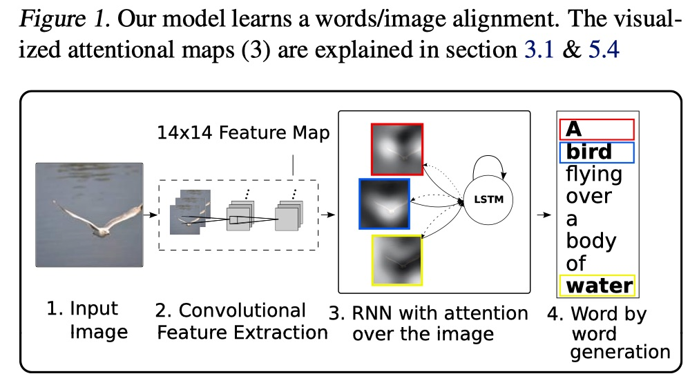
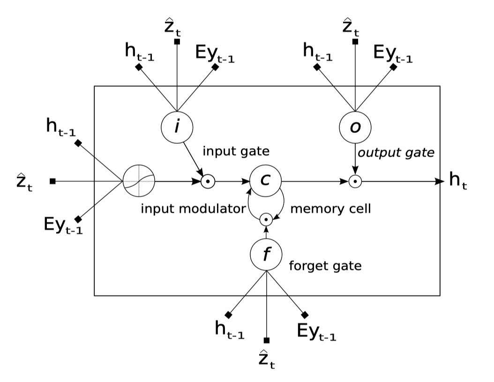
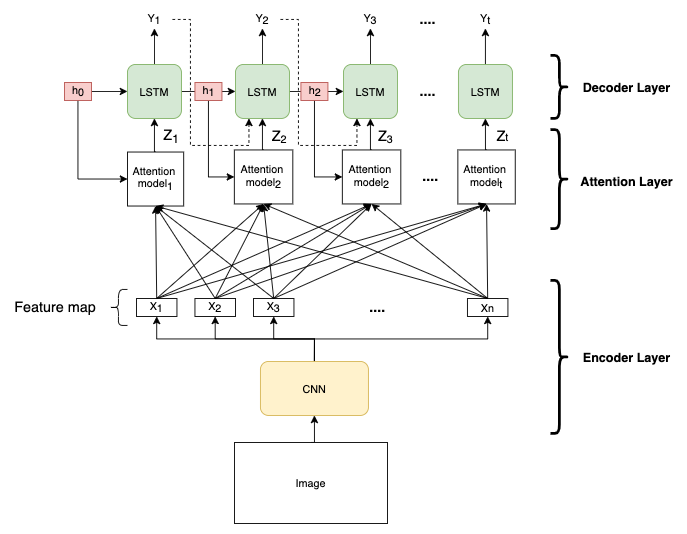
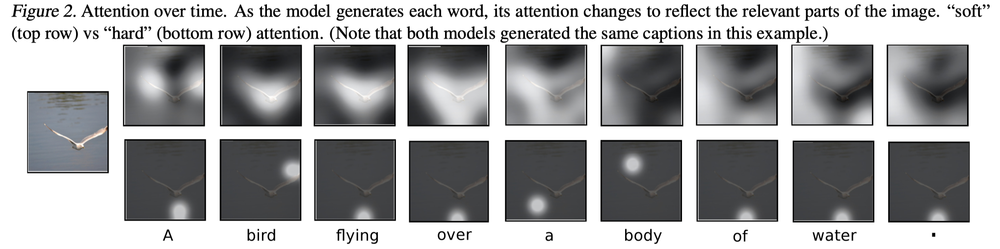

# Attention Mechanism

**Attention** 的概念在 2014 年被 Bahdanau et al. [Paper 1] 所提出，解決了 encoder-decoder 架構的模型在 decoder 必須依賴一個固定向量長度的 context vector 的問題。實際上 attention mechanism 也符合人類在生活上的應用，例如：當你在閱讀一篇文章時，會從上下文的關鍵字詞來推論句子所以表達的意思，又或者像是在聆聽演講時，會捕捉講者的關鍵字，來了解講者所要描述的內容，這都是人類在注意力上的行為表現。

> 用比較簡單的講法來說， attention mechanism 可以幫助模型對輸入 sequence 的每個部分賦予不同的權重， 然後抽出更加關鍵的重要訊息，使模型可以做出更加準確的判斷。

複習一下在之前介紹的 Seq2Seq model 中，decoder 要預測在給定 context vector 與先前預測字詞 $${y_1, \cdots, y_{t-1}}$$ 的條件下字詞 $y_{t}$ 的機率，所以 decoder  的定義是在有序的條件下所有預測字詞的聯合機率：

$$
\begin{align}
p(\mathrm{y}) & = \prod_{t=1}^T p(y_t | \{y_1, \cdots, y_{t-1}\}, c) \tag 1 \\
\mathrm{y} & = (y_1, \cdots, y_T)
\end{align}
$$

在第 $t$ 個字詞，字詞 $y_t$ 的條件機率：

$$
\begin{align}
p(y_t | \{y_1, \cdots, y_{t-1}\}, c) = g(y_{t-1}, s_t, c) \tag 2
\end{align}
$$

當中 $g$ 唯一個 nonlinear function，$s_t$ 為 hidden state，c 為 context vector。

而在 Attention model 中，作者將 decoder 預測下一個字詞的的條件機率重新定義為：

$$
\begin{align}
p(y_i | \{y_1, \cdots, y_{i-1}\}, \mathrm{x}) = g(y_{i-1}, s_t, c_i) \tag 3
\end{align}
$$

當中 $s_i$ 表示 RNN 在 $i$ 時間的 hiddent state。

$$
\begin{align}
s_i = f\left(s_{i-1}, y_{i-1}, c_i\right) \tag 4
\end{align}
$$

將式子 (3) 與 (2) 相比就可以發現，每一個預測字詞 $y_i$ 對於 context vector 的取得，由原本都是固定的 C  轉變成 每個字詞預測都會取得不同的 $C_i$。

Bahdanau Attention model 的架構如圖一：

<figure class="image">

  
  <figcaption>
  圖一(Image credit:[Paper 1])
  </figcaption>

</figure>

Context vector $c_i$ 是取決於 sequence of annotations $$(h_1, h_2, \cdots, h_{T_x})$$ 的訊息，annotation $h_i$ 包含了在第 $i$ 步下， input sequence 輸入到 econder 的訊息。計算方法是透過序列權重加總 annotation $h_i$，公式如下：

$$
\begin{equation}
c_i = \displaystyle\sum_{j=1}^{T_x}\alpha_{ij}h_j \tag5
\end{equation}
$$

其中 $i$ 表示 decoder 在第 $i$ 個字詞，$j$ 表示 encoder 中第 $j$ 個詞。

$\alpha_{ij} $ 則稱之為 attention distribution，可以用來衡量 input sequence 中的每個文字對 output sequence 中的每個文字所帶來重要性的程度，計算方式如下
：
$$
\begin{align}
\alpha_{ij} & = softmax(e_{ij}) \\
& = \frac{exp(e_{ij})}{\sum_{k=1}^{T_x}exp(e_{ik})} \tag6 \\
\end{align}
$$

$$
e_{ij} = a(s_{i-1}, h_j) \tag7
$$

**計算 attention  score $e_{ij}$ 中 $a$ 表示為 alignment model (對齊模型)，是衡量 input sequence 在位置 $j$ 與 output sequence 位置 $i$ 這兩者之間的關係**。
這邊作者為了解決在計算上需要 $T_{x} \times T_{y}$ 的計算量，所以採用了 singlelayer multilayer perceptron 的方式來減少計算量，其計算公式：

$$
\begin{align}
a(s_{i-1}, h_j) = v_a^Ttanh(W_aS_{i-1} + U_ah_j) \tag8
\end{align}
$$

其中 $W_a \in R^{n\times n}，U_a \in R^{n \times 2n}，v_a \in R^n$ 都是 weight。

另外作者在此採用了 BiRNN(Bi-directional RNN) 的 forward 與 backward 的架構，由圖一可以得知

* Forward hidden state 為 $$(\overrightarrow{h_1}, \cdots, \overrightarrow{h_{T_x}})$$
* Backward hidden state 為 $$(\overleftarrow{h_1}, \cdots, \overleftarrow{h_{T_x}})$$
* Concatenate forward 與 backward 的 hidden state，所以 annotation $h_j$ 為 $$\left[\overrightarrow{h_j^T};\overleftarrow{h_j^T}\right]^T$$

這樣的方式更能理解句子所要表達的意思，並得到更好的預測結果。

> 例如以下兩個句子的比較：
1. 我喜歡蘋果，因為它很好吃。
2. 我喜歡蘋果，因為它很潮。

下圖為 Bahdanau Attention model 的解析可以與圖一對照理解，這樣更能了解圖一的結構：

> 需要注意的一點是在最一開始的 decoder hidden state $S_0$ 是採用 encoder 最後一層的 output 

<figure class="image">

  
  <figcaption>
  圖二
  </figcaption>

</figure>

下圖為論文中英文翻譯成法語的 attention distribution：

<figure class="image">

  
  <figcaption>
  圖三(Image credit:[Paper 1])
  </figcaption>

</figure>

在上圖中 $[European \space Economic \space Area]$ 翻譯成$ [zone \space \acute{a}conomique \space europ\acute{e}enne] $ 的注意力分數上，模型成功地專注在對應的字詞上。

# Attention Mechanism Family

Attention score function:

| Name               | Attention score function             |
| ------------------ | ------------------------------------ |
| Dot-product        | $e_{ij} = S_i^Th_j$                  |
| General            | $e_{ij} = S_i^TWh_j$                 |
| Additive           | $e_{ij} = v^Ttanh(WS_{i-1} + Uh_j) $ |
| Scaled Dot-product | $e_{ij} = \frac{S_i^Th_j}{\sqrt{d}}$ |
|                    |                                      |

### Hard Attention & Soft Attention 

Xu et al. [Paper 2] 對於圖像標題(caption)的生成研究中提出了 hard attention 與 soft attention 的方法，作者希望透過 attention mechanism 的方法能夠讓 caption 的生成從圖像中獲得更多有幫助的訊息。下圖為作者所提出的模型架構：

<figure class="image">

  
  <figcaption>
  圖四(Image credit:[Paper 2])
  </figcaption>

</figure>

**模型結構**

* Encoder

  在 encoder 端模型使用 CNN 來提取 low-level 的卷積層特徵，每一個特徵都對應圖像的一個區域
  	
  $$ a = \{a_1, \dots, a_L\}, a_i \in R^D $$
  
  總共有 $L$ 個特徵，特徵向量維度為 $D$。

* Decoder

  採用 LSTM 模型來生成字詞，而因應圖片的內容不同，所以標題的長度是不相同的，作者將標題 $y $ encoded 成一個 one-hot encoding 的方式來表示
  
  $$ y = \{y_1, \dots, y_C\}, y_i \in R^K $$
  
  K 為字詞的數量，C 為標題的長度。下圖為作者這本篇論文所採用的 LSTM 架構：
  
  <figure class="image">
  

  
  <figcaption>
  圖五(Image credit:[Paper 2])
  </figcaption>
  

  </figure>
  
  利用 affine transformation 的方式  $$T_{s, t} : R^s \rightarrow R^t$$ 來表達 LSTM 的公式：

  $$
  \begin{pmatrix}
  i_t \\
  f_t \\
  o_t \\
  g_t 
  \end{pmatrix}
  = 
  \begin{pmatrix}
  \sigma \\
  \sigma \\
  \sigma \\
  tanh 
  \end{pmatrix}
  T_{D+m+n, n}
  \begin{pmatrix}
  Ey_{t-1} \\
  h_{t-1} \\
  \hat{Z_t}
  \end{pmatrix}  \tag1 \\
  $$
  
  $$
  \begin{align}
  c_t & = f_t \odot c_{t-1} + i_t \odot g_t \tag2 \\
  h_t & = o_t \odot tanh(c_t) \tag3
  \end{align}
  $$

  其中
  * $$i_t$$ : input gate
  * $$f_t$$ : forget gate
  * $$o_t$$ : ouput gate
  * $$g_t$$ : canaidate cell
  * $$c_t$$ : memory cell
  * $$h_t$$ : hidden state
  * $$Ey_{t-1}$$ 是詞 $$y_{t-1}$$ 的 embedding vector，$$E \in R^{m \times k}$$ 為 embedding matrix，m 為 embedding dimention
  * $$\hat{Z} \in R^D$$ 是 context vector，代表捕捉特定區域視覺訊息的上下文向量，與時間 $t$ 有關，所以是一個動態變化的量
  
  特別注意的是作者在給定 memory state 與 hidden state 的初始值的計算方式使用了兩個獨立的多層感知器(MLP)，其輸入是各個圖像區域特徵的平均，計算公式如下： 
  
  $$
  \begin{align}
  c_0 = f_{init, c}( \frac{1}{L} \sum_{i}^L a_i) \\
  h_0 = f_{init, h}( \frac{1}{L} \sum_{i}^L a_i)
  \end{align}
  $$

  以及作者為了計算在 $t$ 時間下所關注的 context vector $$\hat{Z_t}$$ **定義了 attention machansim $\phi$ 為在 $t$ 時間，對於每個區域 $i$ 計算出一個權重 $$\alpha_{ti}$$ 來表示產生字詞 $y_t$ 需要關注哪個圖像區域  annotation vectors $a_i, i=1, \dots, L$ 的訊息。**權重 $$\alpha_i$$ 的產生是透過輸入 annotation vector $$a_i$$ 與前一個時間的 hidden state  $h_{t-1}$ 經由 attention model $f_{att}$ 計算所產生。
  
  $$
  \begin{align}
  e_{ti} = f_{att}(a_i, h_{t-1}) \tag4 \\
  \alpha_{ti} = \frac{exp(e_{ti})}{\sum_{k=1}^{L}exp{e_{tk}}} \tag5 \\
  \hat{Z_t} = \phi(\{a_i\}, \{\alpha_{i}\}) \tag6
  \end{align}
  $$
  
  有了上述的資訊，在生成下一個 $t$ 時間的字詞機率可以定義為：

  $$ p(y_t | a, y_1, y_2, \dots, y_{t-1}) \propto exp(L_o(Ey_{t-1} + L_hh_t + L_z\hat{Z_t})) \tag7 $$

  其中 $$L_o \in R^{K \times m}, L_h \in R^{m \times n}, L_z \in R^{m \times D}$$，m 與 n 分別為 embedding dimension 與 LSTM dimension。
  

對於函數 $\phi$ 作者提出了兩種 attention  machansim，對應於將權重附加到圖像區域的兩個不同策略。根據上述的講解，搭配下圖為 Xu et al. [Paper 2] 的模型架構解析，更能了解整篇論文模型的細節：

<figure class="image">

  
  <figcaption>
  圖六
  </figcaption>

</figure>

#### Hard attention (Stochastic Hard Attention)

在 hard attention 中定義區域變數(location variables) $s_{t, i}$ 為在 t 時間下，模型決定要關注的圖像區域，用 one-hot 的方式來表示，要關注的區域 $i$ 為 1，否則為 0。

$s_{t, i}$ 被定為一個淺在變數(latent variables)，並且以 **multinoulli distriubtion** 作為參數 $\alpha_{t, i}$ 的分佈，而 $\hat{Z_t}$ 則被視為一個隨機變數，公式如下：

$$ p(s_{t, i} = 1 | s_{j, t}, a) = \alpha_{t, i} \tag8 $$

$$ \hat{Z_t} = \sum_{i} s_{t, i}a_i \tag9 $$

定義新的 objective functipn $L_s$ 為 marginal log-likelihood $\text{log }p(y|a)$ 的下界(lower bound)

$$
\begin{align}
L_s & = \sum_s p(s|a)\text{log }p(y|s,a) \\
& \leq \text{log } \sum_s p(s|a)p(y|s,a) \\
& = \text{log }p(y|a)
\end{align}
$$

在後續的 $L_s$ 推導求解的過程，作者利用了 

1. Monte Carlo 方法來估計梯度，利用 moving average 的方式來減小梯度的變異數
2. 加入了 multinouilli distriubtion 的 entropy term $H[s]$

透過這兩個方法提升隨機算法的學習，作者在文中也提到，最終的公式其實等價於 **Reinforce learing**。作者在論文中有列出推導的公式，有興趣的可以直接參考論文。

#### Soft attention (Deterministic Soft Attention)

Soft attention 所關注的圖像區域並不像 hard attention 在特定時間只關注特定的區域，在 soft attention 中則是每一個區域都關注，只是關注的程度不同。透過對每個圖像區域 $a_{i}$ 與對應的 weight $\alpha_{t,i}$ ，$\hat{Z}_t$ 就可以直接對權重做加總求和，從 hard attention  轉換到 soft attention 的 context vector：

$$ \hat{Z_t} = \sum_{i} s_{t, i}a_i \implies \mathbb{E}_{p(s_t|a)}[\hat{Z_t}] = \sum_{i=1}^L \alpha_{t,i}a_i $$

這計算方式將 weight vector $\alpha_i$ 參數化，讓公式是可微的，可以透過 backpropagation 做到 end-to-end 的學習。其方法是參考前面所介紹的 Bahdanau attention 而來。

由於公式(7)的定義了生成下一個 $t$ 時間的字詞機率，所以在這邊作者定義了 $$n_t = L_o(Ey_{t-1} + L_hh_t + L_z\hat{Z_t})$$，透過 expect context vector 

另外 soft attention 在最後做文字的預測時作者定義了 softmax $k^{th}$ 的 normalized weighted geometric mean。
$$
\begin{align}
NWGM[p(y_t=k|a)] & = \frac{\prod_i exp(n_{t,k,i})^{p(s_{t,i} = 1 | a)}}{\sum_j\prod_i exp(n_{t,j,i})^{p(s_{t,i} = 1 | a)}} \\
& = \frac{exp\left(\mathbb{E_{p(s_t) | a}[n_{t,k}]}\right)}{\sum_j exp\left(\mathbb{E_{p(s_t) | a}[n_{t,j}]}\right)}
\end{align}
$$

<figure class="image">

  
  <figcaption>
  圖六(Image credit:[Paper 2])
  </figcaption>

</figure>

### Global Attention & Local Attention

總結來說：

>  Attention 要實現的就是在 decoder 的不同時刻可以關注不同的圖像區域或是句子中的文字，進而可以生成更合理的詞。

## Refenece

Paper:

1. [Dzmitry Bahdanau, KyungHyun Cho Yoshua Bengio, NEURAL MACHINE TRANSLATION BY JOINTLY LEARNING TO ALIGN AND TRANSLATE(2015)](https://arxiv.org/pdf/1409.0473.pdf)
2. [Kelvin Xu, Jimmy Ba, Ryan Kiros, Kyunghyun Cho, Aaron Courville, Ruslan Salakhudinov, Rich Zemel, and Yoshua Bengio, Show, Attend and Tell: Neural Image Caption Generation with Visual Attention(2015)](https://arxiv.org/pdf/1502.03044.pdf)
3. [Thang Luong, Hieu Pham, Christopher D. Manning, Effective Approaches to Attention-based Neural Machine Translation(2015)](https://arxiv.org/pdf/1508.04025.pdf)
4. [Sneha Chaudhari, Gungor Polatkan , Rohan Ramanath , Varun Mithal, An Attentive Survey of Attention Models(2019)](https://arxiv.org/abs/1904.02874)

Illustrate:

1. https://zhuanlan.zhihu.com/p/37601161h
2. https://zhuanlan.zhihu.com/p/31547842
3. https://blog.floydhub.com/attention-mechanism/#bahdanau-atth
4. https://web.stanford.edu/class/cs224n/slides/cs224n-2019-lecture08-nmt.pdf
5. https://www.cnblogs.com/Determined22/p/6914926.html
6. https://jhui.github.io/2017/03/15/Soft-and-hard-attention/
7. http://download.mpi-inf.mpg.de/d2/mmalinow-slides/attention_networks.pdf

Tutorial:

1. [Neural Machine Translation (seq2seq) Tutorial](https://github.com/tensorflow/nmt#background-on-the-attention-mechanism)
2. https://www.tensorflow.org/tutorials/text/transformerG
3. [Guide annotating the paper with PyTorch implementation](http://nlp.seas.harvard.edu/2018/04/03/attention.html)

Visualization:

1. https://github.com/jessevig/bertviz
