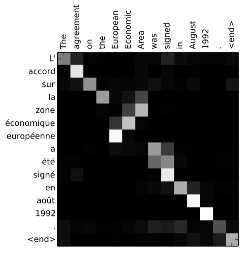

# Attention Mechanism

**Attention** 的概念在 2014 年被 Bahdanau et al. [Paper 1.] 所提出，解決了 encoder-decoder 架構的模型在 decoder 必須依賴一個固定向量長度的 context vector 的問題。實際上 attention mechanism 也符合人類在生活上的應用，例如：當你在閱讀一篇文章時，會從上下文的關鍵字詞來推論句子所以表達的意思，又或者像是在聆聽演講時，會捕捉講者的關鍵字，來了解講者所要描述的內容，這都是人類在注意力上的行為表現。

> 用比較簡單的講法來說， attention mechanism 可以幫助模型對輸入 sequence 的每個部分賦予不同的權重， 然後抽出更加關鍵的重要訊息，使模型可以做出更加準確的判斷。

複習一下在之前介紹的 Seq2Seq model 中，decoder 要預測在給定 context vector 與先前預測字詞 $${y_1, \cdots, y_{t-1}}$$ 的條件下字詞 $y_{t}$ 的機率，所以 decoder  的定義是在有序的條件下所有預測字詞的聯合機率：

$$
\begin{align}
p(\mathrm{y}) & = \prod_{t=1}^T p(y_t | \{y_1, \cdots, y_{t-1}\}, c) \tag 1 \\
\mathrm{y} & = (y_1, \cdots, y_T)
\end{align}
$$

在第 $t$ 個字詞，字詞 $y_t$ 的條件機率：

$$
\begin{align}
p(y_t | \{y_1, \cdots, y_{t-1}\}, c) = g(y_{t-1}, s_t, c) \tag 2
\end{align}
$$

當中 $g$ 唯一個 nonlinear function，$s_t$ 為 hidden state，c 為 context vector。

而在 Attention model 中，作者將 decoder 預測下一個字詞的的條件機率重新定義為：

$$
\begin{align}
p(y_i | \{y_1, \cdots, y_{i-1}\}, \mathrm{x}) = g(y_{i-1}, s_t, c_i) \tag 3
\end{align}
$$

當中 $s_i$ 表示 RNN 在 $i$ 時間的 hiddent state。

$$
\begin{align}
s_i = f\left(s_{i-1}, y_{i-1}, c_i\right) \tag 4
\end{align}
$$

將式子 (3) 與 (2) 相比就可以發現，每一個預測字詞 $y_i$ 對於 context vector 的取得，由原本都是固定的 C  轉變成 每個字詞預測都會取得不同的 $C_i$。

Bahdanau Attention model 的架構如圖一：

<figure class="image">

  
  <figcaption>
  圖一(Image credit:[Paper 1.])
  </figcaption>

</figure>

Context vector $c_i$ 是取決於 sequence of annotations $$(h_1, h_2, \cdots, h_{T_x})$$ 的訊息，annotation $h_i$ 包含了在第 $i$ 步下， input sequence 輸入到 econder 的訊息。計算方法是透過序列權重加總 annotation $h_i$，公式如下：

$$
\begin{equation}
c_i = \displaystyle\sum_{j=1}^{T_x}\alpha_{ij}h_j \tag5
\end{equation}
$$

其中 $i$ 表示 decoder 在第 $i$ 個字詞，$j$ 表示 encoder 中第 $j$ 個詞。

$\alpha_{ij} $ 則稱之為 attention distribution，可以用來衡量 input sequence 中的每個文字對 output sequence 中的每個文字所帶來重要性的程度，計算方式如下
：
$$
\begin{align}
\alpha_{ij} & = softmax(e_{ij}) \\
& = \frac{exp(e_{ij})}{\sum_{k=1}^{T_x}exp(e_{ik})} \tag6 \\
\end{align}
$$

$$
e_{ij} = a(s_{i-1}, h_j) \tag7
$$

**計算 attention  score $e_{ij}$ 中 $a$ 表示為 alignment model (對齊模型)，是衡量 input sequence 在位置 $j$ 與 output sequence 位置 $i$ 這兩者之間的關係**。
這邊作者為了解決在計算上需要 $T_{x} \times T_{y}$ 的計算量，所以採用了 singlelayer multilayer perceptron 的方式來減少計算量，其計算公式：

$$
\begin{align}
a(s_{i-1}, h_j) = v_a^Ttanh(W_aS_{i-1} + U_ah_j) \tag8
\end{align}
$$

其中 $W_a \in R^{n\times n}，U_a \in R^{n \times 2n}，v_a \in R^n$ 都是 weight。

另外作者在此採用了 BiRNN(Bi-directional RNN) 的 forward 與 backward 的架構，由圖一可以得知

* Forward hidden state 為 $$(\overrightarrow{h_1}, \cdots, \overrightarrow{h_{T_x}})$$
* Backward hidden state 為 $$(\overleftarrow{h_1}, \cdots, \overleftarrow{h_{T_x}})$$
* Concatenate forward 與 backward 的 hidden state，所以 annotation $h_j$ 為 $$\left[\overrightarrow{h_j^T};\overleftarrow{h_j^T}\right]^T$$

這樣的方式更能理解句子所要表達的意思，並得到更好的預測結果。

> 例如以下兩個句子的比較：
1. 我喜歡蘋果，因為它很好吃。
2. 我喜歡蘋果，因為它很潮。

下圖為 Bahdanau Attention model 的解析可以與圖一對照理解，這樣更能了解圖一的結構：

> 需要注意的一點是在最一開始的 decoder hidden state $S_0$ 是採用 encoder 最後一層的 output 

<figure class="image">

  
  <figcaption>
  圖二
  </figcaption>

</figure>

下圖為論文中英文翻譯成法語的 attention distribution：

<figure class="image">

  
  <figcaption>
  圖三(Image credit:[Paper 1.])
  </figcaption>

</figure>

在上圖中 $[European \space Economic \space Area]$ 翻譯成$ [zone \space \acute{a}conomique \space europ\acute{e}enne] $ 的注意力分數上，模型成功地專注在對應的字詞上。

# Attention Mechanism Family

Attention score function:

| Name               | Attention score function             |
| ------------------ | ------------------------------------ |
| Dot-product        | $e_{ij} = S_i^Th_j$                  |
| General            | $e_{ij} = S_i^TWh_j$                 |
| Additive           | $e_{ij} = v^Ttanh(WS_{i-1} + Uh_j) $ |
| Scaled Dot-product | $e_{ij} = \frac{S_i^Th_j}{\sqrt{d}}$ |
|                    |                                      |

### Soft Attention & Hard Attention

### Global Attention & Local Attention

attenion value and query 的理解不要被公式混淆，而是從 attention 的概念去了解，query 就是

## Refenece

Paper:

1. [Dzmitry Bahdanau, KyungHyun Cho Yoshua Bengio, NEURAL MACHINE TRANSLATION BY JOINTLY LEARNING TO ALIGN AND TRANSLATE(2015)](https://arxiv.org/pdf/1409.0473.pdf)
2. [Kelvin Xu, Jimmy Ba, Ryan Kiros, Kyunghyun Cho, Aaron Courville, Ruslan Salakhudinov, Rich Zemel, and Yoshua Bengio, Show, Attend and Tell: Neural Image Caption Generation with Visual Attention(2015)](https://arxiv.org/pdf/1502.03044.pdf)
3. [Thang Luong, Hieu Pham, Christopher D. Manning, Effective Approaches to Attention-based Neural Machine Translation(2015)](https://arxiv.org/pdf/1508.04025.pdf)
4. [Sneha Chaudhari, Gungor Polatkan , Rohan Ramanath , Varun Mithal, An Attentive Survey of Attention Models(2019)](https://arxiv.org/abs/1904.02874)

Illustrate:

1. https://zhuanlan.zhihu.com/p/37601161h
2. https://blog.floydhub.com/attention-mechanism/#bahdanau-atth
3. https://web.stanford.edu/class/cs224n/slides/cs224n-2019-lecture08-nmt.pdf

Tutorial:

1. [Neural Machine Translation (seq2seq) Tutorial](https://github.com/tensorflow/nmt#background-on-the-attention-mechanism)
2. https://www.tensorflow.org/tutorials/text/transformerG
3. [Guide annotating the paper with PyTorch implementation](http://nlp.seas.harvard.edu/2018/04/03/attention.html)

Visualization:

1. https://github.com/jessevig/bertviz

