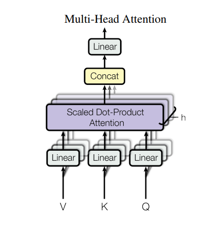

# Transformer

拖延了很久，終於有時間拉把欠的部分補齊了，來講在 NLP 已經廣為人知的 Transformer。在開始介紹前先來附上 transformer 的結構，如下圖：

<figure class="image"> 

  
  <figcaption>
  Image credit: <a href="https://lilianweng.github.io/lil-log/2018/06/24/attention-attention.html">Lil's Log</a>
  </figcaption>

</figure>
在這裡我會把 transformer 拆解如下面幾個主題來解說：

1. Embedding and Softmax
2. Positional Encoding
3. Scaled dot-product attention
4. Multi-head attention
5. Postition-wise Feed-Forward Networks
6. Encoder & Decoder
7. Optimizeer

---
## Embedding and Softmax

Embedding and softmax 這個部分應該比較少看到有人在文章中提出，其實光看字面的意思應該不難理解主要要做些什麼事情，但在論文中提到的主要差異點是說，在模型中在 embedding layer 與 pre-softmax linear transformation layer 使用共享參數矩陣的方式，而在 embedding layer 乘上一個縮放權重 $\sqrt{d_{model}}$，共享參數矩陣的想法可以參考 [Using the Output Embedding to Improve Language Models](https://arxiv.org/pdf/1608.05859.pdf) 篇所提出的概念

> 補充說明：
>
> 在 transformer 中借鏡了 **Using the Output Embedding to Improve Language Models** 的 `weight tying` 的想法，把 embedding and pre-softmax 的 weight 共享，因為在 input 的 sequence 經過 embedding 會得到 word vector，在經過 decoder 計算後，也得到一樣維度的 vector，而在要進入 softmax 前，再乗上一個 weight (在 paper 稱這樣的 weight 為 output embedding)，這樣的操作方式有效的提升 language models。
>
> 後續在 `Tying Word Vectors and Word Classifiers: A Loss Framework for Language Modeling` 與 `How to represent a word and predict it, too: improving tied architectures for language modelling` 這兩篇 paper 也用上 weight tying 的技巧。那麼為什麼這樣的技巧有用，來自於當 model 在做 backpropagation 的時候，在 output embedding 會得到較大的受益，而在 input embedding 所得到的改善，經過模型中多層的 backpropagate 回來後，改變的 weight 的程度就不如 output embedding 來得好。
>
> 在 Using the Output Embedding to Improve Language Models 這篇 paper 有提到他們最好的做法，叫做 `three-way weight tying (TWWT)`，意思就是 input embedding (encoder)、input embedding (decoder)、output embedding (decoder) 都是共享，但如果要達到能夠都共享，在字詞的處理上就需要用到 subwoard (子字詞) 概念的處理方式，目前的處理方式有，Byte Pair Encoding (BPE)、WordPiece 與 Unigram Language Model 這三種方法。
>
> 另外有一個重點，雖然 weight 是共享，但是各層的 bias 是獨立的。那為什麼 transformer 的 embedding 要乘上 $\sqrt{d_{model}}$，我的猜測可能是為了放大 embedding 空間，放讓在最後過 softmax 的時候，讓真正的答案可以得到較高的 probability。

---
## Positional Encoding

一般在做 NLP 的處理上，都會透過 word embedding 的方式將文字轉為向量的方式讓模型可讀，但在 transformer 模型中並非使用 recurrence 或是 convolution 的結構，所以在 self-attention 裡的文字訊息是沒有順序的，而為了讓 Transformer 能夠學習到文字序列中的字詞的順序關係，所以需要額外加入一些「位置資訊」給 Transformer，而 **positional encoding** 就是扮演這個重要的角色。

位置編碼(Positional Encoding) 實作上是直接加到最一開始的詞嵌入向量(word embedding) 裡頭，其直觀的想法是想辦法讓被加入位置編碼的詞嵌入向量在 $d_{model}$ 維度的空間裡頭不只會因為語義相近而靠近，也會因為位置靠近而在該空間裡頭靠近，所以位置編碼的維度與詞嵌入向量的維度是相同的。

論文裡頭使用的位置編碼的公式如下：

$$
PE_(pos, 2i) = sin\left(pos/10000^{2i/d_{model}}\right)
$$
$$
PE_(pos, 2i+1) = cos\left(pos/10000^{2i/d_{model}}\right)
$$

在這裏 pos 指的是編碼的位置，$i$ 則是表示第 $i$ 個維度，就是第 n 個詞的第 i 個維度。Positional embedding 在模型中其實可以被學習的，但這是邊作者會選擇這樣的模型是因為為了使模型可以輕鬆學習相對位置，因為透過固定的公式來表達。

下圖來解釋為什麼要用 sin 與 cos 的函數來處理 positional encoding:

<figure class="image">

  
  <figcaption>
  Image credit: <a href="https://www.amazon.com/Hands-Machine-Learning-Scikit-Learn-TensorFlow/dp/1492032646
">Hands-On Machine Learning with Scikit-Learn, Keras, and TensorFlow</a>
  </figcaption>

</figure>

舉例來說，如果只有用單一的 sin 函數(藍色線)的話，那以 $p = 22$ 與 $p = 35$ 來說，就無法方便出這兩個詞的位置差異$(i = 100)$，但如果多增加了cos 函數(紅線) 的話，那就可以清楚的區分。

---
## Scaled dot-product attention

接下來將會一步一步從模型的內部的細節結構慢慢往外部的結構做講解，首先要講的是 Multi-head attention 中的所使用到的注意力機制 **scale dot-product attention**。

如果閱讀過之前的 [ Transformer part2 - Attention](https://roymondliao.github.io/post/2019-12-16_transformer_part2/) 就能明白注意力機制的運作原理。這邊我取用 [leemeng](leemeng.tw) 在[淺談神經機器翻譯&用 Transformer 與 TensorFlow 2 英翻中](https://leemeng.tw/neural-machine-translation-with-transformer-and-tensorflow2.html) 的解說來複習一下。

> 注意力機制(或稱注意函式，attention function) 在概念上就是拿一個查詢(query) 去跟一組 key-values 做運算，最後產生一個輸出。只是這邊會利用矩陣運算同時讓多個查詢跟一組 key-values 做運算，最大化計算效率，而不管是查詢(query)、鍵值(keys) 還是值(values) 或是輸出，全部都是向量(vectors)。該輸出是 values 的加權平均，而每個 value 獲得的權重則是由當初 value 對應的 key 跟 query 計算匹配程度所得來的。

<figure class="image">

  
  <figcaption>
  Image credit: <a href="https://youtu.be/ugWDIIOHtPA">Hung-yi Lee professor - Transformer</a>
  </figcaption>

</figure>

用一個抽象的例子來說：
假設輸入的文字序列為 They played chess.，"They" 是 subject，"played" 是 verb，在經過 encoder 後，將這樣的訊息轉變編碼向量，假設 decoder 已經翻譯出 subject 的字詞，那接下來需要的就是 verb 詞性的文字，這就像是 encoder 創建了一個 lookup dictionary {'subject': 'They', 'verb': 'played', …}，而 decoder 想要從這個 dictionary 中找到下一個跟 verb 有關的字詞，但是在模型裡面並不會有這樣的資訊去告訴你接下來你要找的 key 是一個 subject 或是 verb，所以在模型中，就利用要尋找這個 verb 的方式當作一個 query，而與每個在 dictionary 中 key 計算相似度，然後透過 softmax 得到相對應的 weight，如果 key 的向量表示與 query 越相似，則 weight 就越接近 1。

相似度的計算公式如下：

$$
Attnetion\left(Q, K, V \right) = softmax\left(\frac{QK^{T}}{\sqrt{d_{keys}}}\right)V \\
$$

* $Q$ 是一個 matrix，每一列包含 query 的資訊，維度 $(n_{queries}, d_{keys})$
* $K$ 是一個 matrix，每一列包含 key 的資訊，維度 $(n_{keys}, d_{keys})$
* $V$ 是一個 matrix，每一列包含 value 的資訊，維度 $(n_{keys}, d_{values})$
* $QK^T$ 維度 $(n_{queries}, n_{keys})$ 為相似度的分數(similarity score)
* $\sqrt{d_{keys}}$ 是一個縮放因子(scaling factors)，為了避免 softmax function 的結果過飽和，而造成 gradients 的結果很小。

就我個人的看法是認為，如果從 attention 慢慢演化到 self-attention 的過程來看，$K, Q, V$ 其實不帶任何意義，從過往對 attention 的理解，$QK^T$ 的計算只是為了符合在 attention 中，decoder 的 output 去關注 encoder 的 output 來得到 similarity score，所以就如同 self-attention 的字面意義一樣，為了要得到類似於 attention 的結果。

---
## Multi-head attention

在 Multo-head attention 中，會將 $Q、K$ 以及 $V$ 這三個張量先個別轉換到 $d_{model}$ 維空間，再將其拆成多個比較低維的 depth 維度 $h$ 次以後，將這些產生的 $sub \space q、sub \space k$ 以及 $sub \space v$ 分別丟入前面講解的注意函式得到 $h$ 個結果。接著將這 $h$ 個 $heads$ 的結果串接起來，最後通過一個線性轉換就能得到 multi-head attention 的輸出。如下圖所示：

<figure class="image">

  
  <figcaption>
  Image credit: <a href="https://www.tensorflow.org/tutorials/text/transformer#scaled_dot_product_attention">Tensorflow Tutorials</a>
  </figcaption>

</figure>
然而為何要那麽要把本來 $d_{model}$ 維的空間投影到多個維度較小的子空間(subspace) 以後才各自進行注意力機制呢？

這是因為這樣的處理方式給予模型更大的彈性，讓它可以同時關注不同位置的子詞在不同子空間下的 representation，而不是本來 $d_{model}$ 維度下的一個 representation，而且這樣的做法也相對地降低了所需要的計算量。

$$
MultiHead\left(Q, K, V\right) = Concat\left(head_{1}, \dots, head_{h}\right)W^O 
$$

$$
where \space head_i = Attention\left(QW_{i}^{Q}, KW_{i}^{K}, VW_{i}^{V}\right)
$$

Where the projections are parameter matrices:
$$
W_{i}^{Q} \in R^{d_{model} \times d_k}, W_{i}^{K} \in R^{d_{model} \times d_k}, W_{i}^{V} \in R^{d_{model} \times d_v} and \space W^o \in R^{hd_v \times d_{model}}
$$

論文中的設定 $h = 8$，$d_k = d_v = d_{model} / h = 512 / 8 = 64$。

Multi-head attention 運用在 Transformer 三個不同的地方：

1. 在 **encoder-decoder attention layers**，當中 queries 是從 decoder 前一層的所 output 的值，而 keys 與 values 則是從 encoder 所 output 的值。這樣的運作方式，可以讓每個位置的 decoder 結果去關注所有 input sequence。
2. 在 encoder 中的 **self-attention layers**，對所有的 keys、values 與 queries 都是來至前一層的 output 結果，這讓每個位置的詞都能去關注與自身有關係的詞
3. 在 decoder 中的 **self-attention layers**，其概念與上述的 encoder 相同，唯一的差異就是在 decoder 這邊的輸入是 target sequence，所以為了避免偷看答案的情形出現，並保持 auto-regressive 的特性，所以必須要加上遮罩(mask)，來避免模型得知句子的結果。而實作上 mask 的處理是在 **scale dot-product attention** 裡面來執行的。

---
## Postition-wise Feed-Forward Networks

在 Encoder 跟 Decoder 裡頭都各自有一個 Feed Forward Networks，其組成是由兩個 linear transformations 所組成，使用的 activation function 是 ReLU 。公式如下：
$$
FFN(x)=max(0,xW_1+b_1)W_2+b_2
$$

Linear transformations 被應用在相同的位置上，但在不同層之間的參數就不相同。在兩層的線性轉換中，論文中設計了一個鑽石模型，讓輸入的維度與輸出的維度相同皆為 $d_{model} = 512$，但在 FFN 的中間層維度則為較大的維度為 2048。其目的是為了讓模型能夠學習到到高層次的抽象理解與減少直接 fully-connected 的計算量。

---
## Encoder & Decoder

<figure class="image">

  
  <figcaption>
  Image credit: <a href="https://www.tensorflow.org/tutorials/text/transformer#encoder_and_decoder">Tensorflow Tutorials</a>
  </figcaption>

</figure>

由了上述各個細部結構的理解後，再來看大結構 Encoder 與 decoder 就很容易了久，因為只是將前面的小結構做組合而已。在講解的過程中，我們都只是以一個 layer 來看講解，如上圖就是一個 transformer layer，而實際上論文是堆疊了 6 層的 transformer layers。底下附上兩層的組合，讓讀者可以比較有概念。

<figure class="image">

  
  <figcaption>
  Image credit: <a href="https://leemeng.tw/neural-machine-translation-with-transformer-and-tensorflow2.html#Position-wise-Feed-Forward-Networks"> leemeng : 淺談神經機器翻譯&用 Transformer 與 TensorFlow 2 英翻中</a>
  </figcaption>

</figure>

* Encoder
  * 由 6 個 encoder layers 堆疊組成
  * 每個 encoder layer 都包含兩個 sublayers:
    1. Multi-head attention (with padding mask)
    2. Postition-wise Feed-Forward Networks
  * 每個 sublayer 都有一個殘差連結(residual connection) 來緩解梯度消失(Gradien vanishing) 的狀況
  * 在每個 sublayer 後的 output 都會再經過針對最後一維 $d_{model}$ 做 layer normalization 的處理
    $$
    LayerNorm(x + Sublayer(x))
    $$
  
* Decoder
  * 與 Encoder 相同，都是由 6 個 decoder layers 堆疊組成
  * 每個 decoder layer 都包含三個 sublayers:
    1. Masked multi-head attention (with look ahead mask and padding mask)
    2. Multi-head attention (with padding mask). $V (value)$ 與 $K(key)$ 的輸入來至於 encoder output，$Q(query)$ 的輸入來至於 Masked multi-head attention sublayer output
    3. Postition-wise Feed-Forward Networks
  * 與 Encoder 相同，在每個 sublayer 之後都 residual connection 與 layer normalization 的運作

## Optimizer

模型所使用的 optimizer 是 adam 加上 warmup 的設計，但這邊的 warmup 與我們一般理解的 learning rate warmup 有些許不同，這邊採用的是用 $d_{model}^{-0.5}$ 來當作每一步要增加的 learing rate 比例，這邊就直接擷取論文中的段落做呈現：

> We used the Adam optimizer with $\beta_1 = 0.9, \beta_2 = 0.98$ and $\epsilon \in 10^{-9}$. We varied the learning rate over the course of training, according to the formula:$$
lrate = d_{model}^{-0.5} \cdot min\left(step\\_num^{-0.5}, warmup\\_steps^{-1.5} \right)
$$This corresponds to increasing the learning rate linearly for the first $warmup\\_steps$ training steps, and decreasing it thereafter proportionally to the inverse square root of the step number. We used $warmup\_steps = 4000$.

除了這邊些的優化改動外，還有使用了 Residual Dropout $P_{drop} = 0.1$ 與 Label Smoothing $\epsilon_{ls} = 0.1$ 的技巧來優化模型結果。

最後的模型表現就請各位直接翻翻論文看一下，這邊就不再多做解說了。在經歷 transformer 三部曲後，應該都對 transformer 有更深的了解，之後將會往 transformer 的延伸應用，也就是目前在 NLP 領域最廣為被大家使用或是被拿來優化的˙ **BERT** 做解說。

# Reference

1. [The IIIustrated Transformer](https://jalammar.github.io/illustrated-transformer/)
2. [w淺談神經機器翻譯 & 用 Transformer 與 Tensorflow2](https://leemeng.tw/neural-machine-translation-with-transformer-and-tensorflow2.html#top)
3. [Attention is all you need 解讀](https://zhuanlan.zhihu.com/p/34781297)
4. [Transformer model for language understanding by google](https://www.tensorflow.org/tutorials/text/transformer)
5. [How Self-Attention with Relative Position Representations works](https://medium.com/@_init_/how-self-attention-with-relative-position-representations-works-28173b8c245a)
