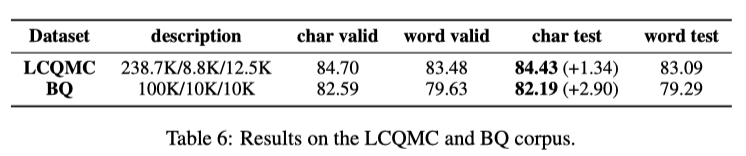
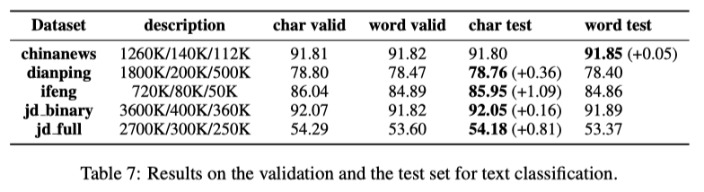
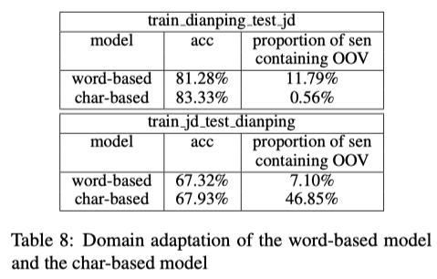
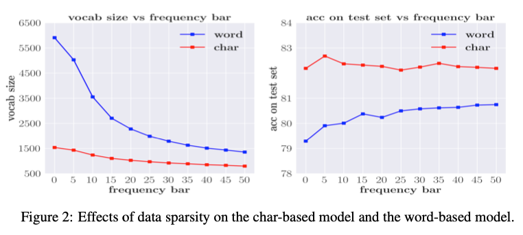
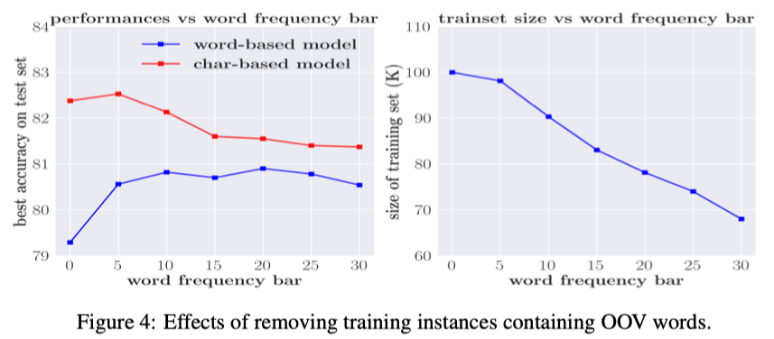
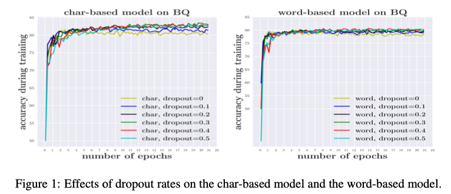
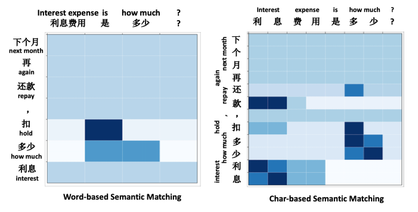

# Chinese word segmentation (CWS)

NLP 領域在近年的突破性發展，各項研究應用與相關論文不斷的推層出新，對於如何讓機器能更了解文章、句子所表達的內容，進而解決各項在 NLP 領域上的問題，在 [OpenA](https://openai.com/)I 近期推出的 [GPT-3](https://github.com/openai/gpt-3) 已經將 NLP 研究推向高峰，但當中還是有一些 NLP 的相關議題是比較少被拿來討論的，尤其是對於**中文**的處理，大部分的 NLP 都還是環繞在英文為主，畢竟大部分的新方法都是由歐美的學者所提出。

字詞的**斷詞方法**一直都是 NLP 相關任務的重點，尤其是目前為主流的 pretrain model 研究發展走向，好的斷詞可讓機器理解整句話所要表達的意思也可以推論語句的結構，反之不好的斷詞可能會讓機器理解錯誤也連帶影響後續的下游任務表現。

在本次要節錄的論文是由[香儂科技(Shannon AI)](https://www.shannonai.com/) 發表在ACL上的一篇論文，主要是探討基於深度學習的中文 NLP 任務中對於中文字斷詞的處理方式，是要以**詞(word-base)** 還是**字(char-base)**的處理方式比較。

## Introduction

Word-base 的處理方式有幾項缺點：

1. 由於字詞的組合過多，且有些詞出現的頻濾可能相當低，所以容易造成資料過於稀疏的狀況，所以無法避免 **out-of-vocabulary(OOV)** 的問題產生，進而限制了模型的學習能力，根據 [Zipf's law](https://en.wikipedia.org/wiki/Zipf%27s_law) 其表示詞的出現的頻率與語料中的排名成反比。

   在論文中以 Chinese Treebank dataset(CTB) 為例，使用 [Jieba](https://github.com/fxsjy/jieba) 作為斷詞的處理方式，最終總共有 615,194 個字詞，當中包含了 50,266 個不重複詞，而在其中又只有 24,458 個字詞只出現過一次，佔比 48.7%，對於整體字詞來說佔了 4% 。如果將字詞出現的次數提高到4 次以下來觀察，就佔了詞的 77.4%，佔整體字詞約 10.1%。其統計結果如下圖：

   <figure class="image"> 
   

     
     <figcaption>
     Image credit: <a href="https://arxiv.org/abs/1905.05526">Paper</a>
     </figcaption>
   

   </figure>

   由統計結果可以得知 word base 的處理在資料上是非常稀疏的。

2. **資料稀疏(data sparsity)**的問題，會造成 **model overfitting** 而且也會產生大量的參數，所以如果要維護一個龐大的字詞語料庫，可想而知在現實狀況的處理上這是不洽當的。

3. 在斷詞上的錯誤會連帶給下游任務帶來 bias，尤其中文在斷詞的處理上有許多模糊的邊界地帶。例如：部分居民生活水平，正確的切分為 `部分/居民/生活/水平`，但也被切成 ` 部/分居/民生/活/水平` 的狀況

此外，在 neural network model 流行之前，`斷詞的必要性`就已經有被拿來討論，是否斷詞能帶來模型的效能提升。在 2004 年 Schubert Foo and Hui Li.[^1] 討論在 Information retrieval(IR) 系統上 CWS 的影響，研究顯示在文本搜尋上使用 CWS 的 model 表現並不是每次都比沒有使用 CWS 的模型來的好。另外在 Xu et al. (2004) [^2] 、Zhao et al. (2013)[^3] 、Liu et al. (2007)[^4] 都提出了使用 CWS 的處理，並沒有能夠有效的提升模型的效能。

綜合以上所提出的論點，本篇論文就以下面這句話來作為主軸，來探討其必要性。

> **Whether word segmentation is necessary for deep learning-based Chinese natural language processing.**

其實在 Yin et al., 2016[^5]; Dong et al., 2016[^6]; Yu et al., 2017[^7] 都證明了基於 char-base 的處理方式對於模型的效能提升好過於使用 word-base，而且也比較了採用 char-base 與 word-base 混合的處理方式，也並沒有優於 char-base 的表現。

## Analysis & Experimental Results

論文中將對四項任務進行 word-base 與 char-base 的比較分析。

#### 1. Language modeling

Detail:

* Data
  * 資料使用 Chinese Tree-Bank 6.0 (CTB6) 作為訓練資料，並切分 80%、10%、10% 分為 training、validation 與 testing set
* Model
  * 文字的斷詞採用 Jieba 處理
  * 模型使用 LSTM，hyper-parameters 的 tuning 採用 grid search 的方式

其實驗結果如下：

<figure class="image"> 

  
  <figcaption>
  Image credit: <a href="https://arxiv.org/abs/1905.05526">Paper</a>
  </figcaption>

</figure>
由上表可得知，在 language modeling 任務中 char-base 的表現遠優於其他的處理方式。另外作者也嘗試採用不同的套件 CWS package (Monroe et al., 2014)[^8]與 LTP package (Che et al., 2010)[^9]對字詞做斷詞的處理，得到的結果與上述雷同。當中 hybird(char only) 的處理方式，是一個先用 word-base 的斷詞，然後在 embedding 的使用則是將 word 的組成拆成 char-base 作為輸入。

#### 2. Machine Translation

Detail:

* Data
  * Training set: 使用 [LDC corpora.](https://www.ldc.upenn.edu/) 的 CH-EN/EN-CH當作訓練資料，當中包含 1.25M 的中翻英語句
  * Validation set: [NIST](https://www.nist.gov/) 2002
  * Testing set: NIST 2003, 2004, 2005, 2006 與 2008
  * 使用 top 30,000 個英文字與 27,500 的中文當作詞庫；對於 char-base 的部分，vocab size 只有 4,500. 個字
* Model
  * 模型使用 SEQ2SEQ + Attention (Sutskever et al., 2014[^10]; Luong et al., 2015[^11])
  * 採用 bag-of-words 的機制 Ma et al. (2018)[^12]
  * 使用 BLEU 做為評分指標

分別對 CH-EN/EN-CH 進行實驗，其結果如下：

**CH-EN** 的實驗部分， char-based model 的表現平均高出 0.83 分，採用了 bag-of-words 方法後，雖然兩種處理方式整體表現都往上提升，但是 char-based model 還是高出 0.63 分的表現。

<figure class="image"> 

  
  <figcaption>
  Image credit: <a href="https://arxiv.org/abs/1905.05526">Paper</a>
  </figcaption>

</figure>
**EN-CH **的實驗部分，char-based model 的表現則遠遠優於 word-based model，平均整整高出了 3.13 分。對比 **CH-EN** 的實驗結果，會有如此大的差距，是因為在 CH-EN 的斷詞處理只有在 source 部分，而對於 EH-CH 的斷詞處理則在 source 與 target 都有。

<figure class="image"> 

  
  <figcaption>
  Image credit: <a href="https://arxiv.org/abs/1905.05526">Paper</a>
  </figcaption>

</figure>

#### 3. Sentence Matching/Paraphrase

Detail:

* Data

  * [BQ dataset](https://www.aclweb.org/anthology/D18-1536/)，包含 120,000 個中文語句配對，label 為兩個語句是否表達相似意思

  * [LCQMC](https://www.aclweb.org/anthology/C18-1166/) 與 BQ 的資料相似，一樣是語句的配對，但差異在於，不同的語意，但其背後想表達的意思是雷同的，例如：`My phone is lost` 與 `I need a new phone`的組合，表達不同的意思，但其隱含意思都是 `buying a new phone.`

* Model
    * 文字的斷詞採用 Jieba 處理
    * SOTA model: bilateral multiperspective matching model (BiMPM) (Wang et al., 2017[^13]).

<figure class="image"> 

  
  <figcaption>
  Image credit: <a href="https://arxiv.org/abs/1905.05526">Paper</a>
  </figcaption>

</figure>

同樣的從實驗結果可以得知，在 char-based model 的表現優於 word-based model。

#### 4. Text Classification

Detail:

* Data
  * ChinaNews：包含7種不同類別的新聞文章
  * Ifeng：只有新聞文章的第一個段落，包含5種不同類別
  * JD_Full：從 JD.com 爬蟲下來的資料，為商品評價資訊，用戶對商品進行 1-5 分的評分，為多分類任務
  * JD_binary：與 JD_Full 相同，但作者將 1-2 分分為 `negative`、4-5 分分為 `positive`、3 分則不參考，為二元分類任務
  * Dianping：中式餐廳的用戶評價，1-3 分為 `negative`、4-5 分為 `positive`，資料從 Dazhong Dianping 上爬下來的
* Model
  * Bi-directional LSTM model

<figure class="image"> 

  
  <figcaption>
  Image credit: <a href="https://arxiv.org/abs/1905.05526">Paper</a>
  </figcaption>

</figure>

實驗結果當中比較特別是在 `chinanews` 這個 database 的結果是 word-based model 表現略好於 char-based model，其餘的部分還是跟其他任務相同，char-based model 表現較好。

#### 5. Domain Adaptation Ability

在進行完上述的實驗後，作者認為由於資料稀疏的問題，所以提出了以下的假設

> We hypothesize that char-based models have greater domain adaptation ability than word-based models.

Detail:

* Data
  * train_dianping_test_jd： 訓練集來源為 Dianping(2M)，測試集來源為 JD_binary(0.25M)
  * train_jb_test_dianping： 訓練集來源為 JD_binary，測試集來源為 Dianping

實驗結果如下：

<figure class="image"> 

  
  <figcaption>
  Image credit: <a href="https://arxiv.org/abs/1905.05526">Paper</a>
  </figcaption>

</figure>

透過交換訓練集與測試集的實驗方式，可以得知 char-base 在領域適應(domain adaptation)上的表現比 word-base 來得要好。其中在 `train_dianping_test_jd` 的訓練組合上也顯示出 test sentences 在 word-base  OOV 的比例佔了 11.79% ，而在 char-base 只佔了 0.56%，表示出 OOV 問題影響了 model 的表現，但在 `train_jd_test_dianping` 卻是相反的結果，這邊認為有可能是作者寫反了。

## Experiment

透過各項的實驗結果來看，可以了解 word-based model 表現比較差的原因如下：

#### Data Sparsity

為了避免 vocabulary 的資料量過大，通常會對字詞出現的頻次設定一個 threshold ，如果字詞出現的頻次低於 threshold 的門檻，其 token 就用 `UNK` 來顯示，下圖表示了詞表大小與 threshold 設定的關係以及 threshold 的設定與 model 的表現：

<figure class="image"> 

  
  <figcaption>
  Image credit: <a href="https://arxiv.org/abs/1905.05526">Paper</a>
  </figcaption>

</figure>
從上圖的關係可以得知，當字詞頻次的 threshold 的值越高，model 的表現就會越來越接近，反之 threshold 越小，model 的表現越差。在這樣的結果下作者認為如果字詞出現的頻次太小，不管是 word/char-base 都難以學到語句的意義，就像人類對於不常看見的文字也是缺乏理解。(不過這邊 char-base 的表現並不是那麼的明顯)

此外，在實驗中 char-based model 最好的結果是 `threshold=5`，詞表大小為 1432，字詞的頻次的中位數為 72，而 word-based model  最好的結果是 `threshold=50`，詞表大小為 1355，字詞的頻次的中位數為 83，可以發現兩個方法最好模型的結果所對應的詞表大小與字詞頻次中位數的數值都差不多，也就是說，為了讓 word/char-based model 能夠學習到更好的語義訊息，需要讓每個 word/char 能夠有足夠的曝光(表示在詞表中詞出現的頻次需求)，word-based model 由於詞表數據過多，特徵過多，且部分字詞出現的頻次不足，所以表現較差。

#### Out-of-Vocabualary Words

Word-based model 表現得不好的其中一個原因就是包含太多 OOV，但是在前面 **data sparsity** 的部分也說明到，如果降低字詞頻次的門檻，那將會導致稀疏程度的增加，而影響模型的表現。於是作者進行了一項實驗，對於不同的 threshold，將包含OOV 的語句從 training、validation 與 testing 資料集中移除，下圖顯示實驗的結果：

<figure class="image"> 

  
  <figcaption>
  Image credit: <a href="https://arxiv.org/abs/1905.05526">Paper</a>
  </figcaption>

</figure>

可以看見當增加字詞出現的頻次後，兩個模型之間的差距正在逐漸地縮小；持續將 threshold 調高，word-based model 的表現持續往上提高，就算調高 50 也是持續上升，這就表示 word-based model 可以透過減少 OOV 語句數量來減緩模型的表現較差的狀況，不過這邊這樣的處理方式在現實的環境上是不太可能，除非在建構 hybird system 有專門的模型或是方法來處理 OOV 的句子。

#### Overfitting

**Data sparsity** 的問題導致 word-based model 需要更多的參數來學習，因此更容易的 **overfitting**。根據這個假設作者透過 BQ 的資料來進行實驗，其實驗結果如下：

<figure class="image"> 

  
  <figcaption>
  Image credit: <a href="https://arxiv.org/abs/1905.05526">Paper</a>
  </figcaption>

</figure>

為了達到最好的結果，word-based model 的 dropout 設置須為 0.5，而 char-based model 只需要設置為 0.5，這意味著 overfitting 對於 word-based model 來說是一個嚴重的問題。另外作者還注意到在不同的 dropout 設定上，word-based model 的表現都相當的接近，但 char-based model 卻有較明顯的差異，這顯示出 dropout 的方式並不足夠能解決 overfitting 的問題。

最後藉由 BQ 資料集的資料展現在不同斷詞方法中模型對於語句 attention 的情況，如下圖：

<figure class="image"> 

  
  <figcaption>
  Image credit: <a href="https://arxiv.org/abs/1905.05526">Paper</a>
  </figcaption>

</figure>

# Conclusion

對於在論文的一開始作者給出的問題，從各項實驗的結果來評斷，char-based model 的表現始終優於 word-based model；而 word-based model 表現不好的原因在於字詞稀疏的問題，連帶導致 OOV、overfitting、lack of domain generalization ability 的狀況產生。

# Other

雖然本篇的結論表示了 char-based model 的表現優於 word-based model，藉由**苏剑林**大神的部落格文章 [提速不掉点：基于词颗粒度的中文WoBERT](https://kexue.fm/archives/7758) 這篇得知，近期[哈爾濱工業大學](https://www.hit.edu.cn/)開源了以 word-base 為主的 BERT 模型，並且確保了模型效果，稱之為 [**WoBERT**](https://github.com/ZhuiyiTechnology/WoBERT)。

其切入角度以目前主流的 pretrain model 的方式來處理 word-base model 表現不好的問題，為何這麼說呢？其原因是在目前的 NLP 任務上，大多都採用 pretrain model 為基底，之後再做 fine-tuning 或是 transfer learning 的處理，所以在 embedding layer 的部分並不會是以隨機初始化的情況下去做建模，想當然爾如果是從頭開訓練，word-base model 的 embedding layer 參數量一定更多，自然就容易 overfitting，模型的效果也會變差。所以，在基於這樣的問題狀況下，採用 pretrain model 預訓練好的詞項量，之後再進行 word-base 的處理，就會是比較好的手段。

文章中說明了 word 與 char 的優點：

* Char base
  * 模型參數量較少，不容易 overfitting
  * 不依賴斷詞的算法，避免斷詞邊界的模糊地帶
  * 資料稀疏程度不嚴重，較少出現 OOV 的狀況
* Word base
  * 序列較短，處理速度較快
  * 在文本生成任務上能夠降低 [Expousure Bias]((https://kexue.fm/archives/7259)) 問題
    * 由於序列較短，所以 Expousure bias 的問題並不明顯
  * 詞義的不確性較低，降低建模複雜度
    * 雖然有多義詞的存在，但多數多義詞的意義都是比較明確的，比起字義更加明確，這樣只需要一個 embedding 就能把詞表達準確，而不用像 char-base model 需要多層膜型才能把自組合成詞

此外一些在 char-base 為優點的，在 word-base 被視為缺點的，可以通過一些技巧來處理，例如：

1. 參數量過多，但可以通過預訓練的模型來緩解 overfitting 的問題
2. Word-base 依賴斷詞演算法，但如果只保留最常見的一部詞(出現頻次較高的)，不管哪種斷詞演算法其結果都是差不多的，差異性不大
3. 斷詞邊界的模糊地帶，這較難以避免，但除非是序列標類任務，否則文本分類、文本生成都不太需要準確的邊界
4. 可以把常出現的用字加入到詞表中，避免 OOV 的問題，這點李宏毅也有提到，中文常見的用字大約 3000 個左右

## WoBERT

概念相當簡單，在 [RoBERTa-wwm-ext](https://github.com/ymcui/Chinese-BERT-wwm) 的基礎上再進行預訓練，預訓練任務為 MLM。在詞的 embeding layer 初始化階段，將每個詞用 BERT 所提供的 tokenizer 切分為字，然後在用字所得到的 embedding 取平均作為詞的 embedding 初始化，剩下的就是訓練模型。模型的訓練結果可以直接參考一開始所提供的文章連結，裡面有詳細的訓練結果展示。

此外在今年 ACL 2020 的會議，[創新工場](https://www.chuangxin.com/)有兩篇關於中文斷詞方法的論文入選，分別是：

1. [Improving Chinese Word Segmentation with Wordhood Memory Networks](https://www.aclweb.org/anthology/2020.acl-main.734/)
2. [Joint Chinese Word Segmentation and Part-of-speech Tagging via Two-way Attentions of Auto-analyzed Knowledge](https://www.aclweb.org/anthology/2020.acl-main.735/)

如果不想直接看論文也可以看看機器之心所撰寫的簡介[创新工场两篇论文入选ACL 2020，将中文分词数据刷至新高](https://www.jiqizhixin.com/articles/2020-07-09-2)，關於中文斷詞的分享就到這邊結束。

# Reference

[^1]:  Schubert Foo and Hui Li. 2004. Chinese word segmentation and its effect on information retrieval. Information processing & management, 40(1):161–190.
[^2 ]: Xin Liu, Qingcai Chen, Chong Deng, Huajun Zeng, Jing Chen, Dongfang Li, and Buzhou Tang. 2018. Lcqmc: A large-scale chinese question matching corpus. In Proceedings of the 27th International Conference on Computational Linguistics, pages 1952–1962.

[^3 ]: Hai Zhao, Masao Utiyama, Eiichiro Sumita, and BaoLiang Lu. 2013. An empirical study on word segmentation for chinese machine translation. In International Conference on Intelligent Text Processing and Computational Linguistics, pages 248–263. Springer.
[^4]: Wei Liu, Ben Allison, David Guthrie, and Louise Guthrie. 2007. Chinese text classification without automatic word segmentation. In Sixth International Conference on Advanced Language Processing and Web Information Technology (ALPIT 2007), pages 45–50. IEEE.
[^5]: Rongchao Yin, Quan Wang, Peng Li, Rui Li, and Bin Wang. 2016. Multi-granularity chinese word embedding. In Proceedings of the 2016 Conference on Empirical Methods in Natural Language Processing, pages 981–986.
[^6]: Chuanhai Dong, Jiajun Zhang, Chengqing Zong, Masanori Hattori, and Hui Di. 2016. Characterbased lstm-crf with radical-level features for chinese named entity recognition. In Natural Language Understanding and Intelligent Applications, pages 239250. Springer.
[^7]: Jinxing Yu, Xun Jian, Hao Xin, and Yangqiu Song. 2017. Joint embeddings of chinese words, characters, and fine-grained subcharacter components. In Proceedings of the 2017 Conference on Empirical Methods in Natural Language Processing, pages 286–291.

[^ 8]: Will Monroe, Spence Green, and Christopher D Manning. 2014. Word segmentation of informal arabic with domain adaptation. In Proceedings of the 52nd Annual Meeting of the Association for Computational Linguistics (Volume 2: Short Papers), volume 2, pages 206–211.
[^9]: Wanxiang Che, Zhenghua Li, and Ting Liu. 2010. Ltp:A chinese language technology platform. In Proceedings of the 23rd International Conference on Computational Linguistics: Demonstrations, pages 13–16. Association for Computational Linguistics.
[^10]: Ilya Sutskever, Oriol Vinyals, and Quoc V Le. 2014. Sequence to sequence learning with neural networks. In Advances in neural information processing systems, pages 3104–3112.
[^11]: Minh-Thang Luong, Hieu Pham, and Christopher D Manning. 2015. Effective approaches to attentionbased neural machine translation. ACL.
[^12]: Shuming Ma, Xu Sun, Yizhong Wang, and Junyang Lin. 2018. Bag-of-words as target for neural machine translation. arXiv preprint arXiv:1805.04871.

[^13]: Zhiguo Wang, Wael Hamza, and Radu Florian. 2017.Bilateral multi-perspective matching for natural language sentences. IJCAI.

