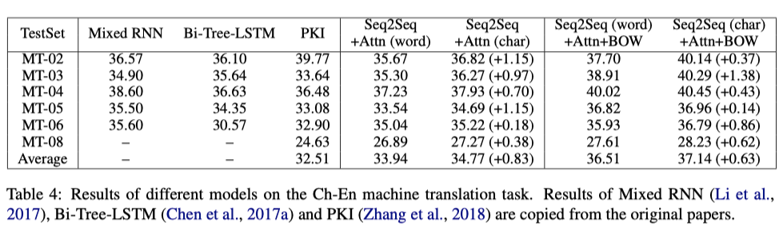

# Chinese word segmentation (CWS)

NLP 領域在近年的突破性發展，各項研究應用與相關論文不斷的推層出新，對於如何讓機器能更了解文章、句子所表達的內容，進而解決各項在 NLP 領域上的問題，在 [OpenA](https://openai.com/)I 近期推出的 [GPT-3](https://github.com/openai/gpt-3) 已經將 NLP 研究推向高峰，但當中還是有一些 NLP 的相關議題是比較少被拿來討論的，尤其是對於**中文**的處理，大部分的 NLP 都還是環繞在英文為主，畢竟大部分的新方法都是由歐美的學者所提出。

字詞的**斷詞方法**一直都是 NLP 相關任務的重點，尤其是目前為主流的 pretrain model 研究發展走向，好的斷詞可讓機器理解整句話所要表達的意思也可以推論語句的結構，反之不好的斷詞可能會讓機器理解錯誤也連帶影響後續的下游任務表現。

在本次要節錄的論文是由[香儂科技(Shannon AI)](https://www.shannonai.com/) 發表在ACL上的一篇論文，主要是探討基於深度學習的中文 NLP 任務中對於中文字斷詞的處理方式，是要以**詞(word-base)** 還是**字(char-base)**的處理方式比較。

## Introduction

Word-base 的處理方式有幾項缺點：

1. 由於字詞的組合過多，且有些詞出現的頻濾可能相當低，所以容易造成資料過於稀疏的狀況，所以無法避免 **out-of-vocabulary(OOV)** 的問題產生，進而限制了模型的學習能力，根據 [Zipf's law](https://en.wikipedia.org/wiki/Zipf%27s_law) 其表示詞的出現的頻率與語料中的排名成反比。

   在論文中以 Chinese Treebank dataset(CTB) 為例，使用 [Jieba](https://github.com/fxsjy/jieba) 作為斷詞的處理方式，最終總共有 615,194 個字詞，當中包含了 50,266 個不重複詞，而在其中又只有 24,458 個字詞只出現過一次，佔比 48.7%，對於整體字詞來說佔了 4% 。如果將字詞出現的次數提高到4 次以下來觀察，就佔了詞的 77.4%，佔整體字詞約 10.1%。其統計結果如下圖：

   <figure class="image"> 
   

     
     <figcaption>
     Image credit: <a href="https://arxiv.org/abs/1905.05526">Paper</a>
     </figcaption>
   

   </figure>

   由統計結果可以得知 word base 的處理在資料上是非常稀疏的。

2. **資料稀疏(data sparsity)**的問題，會造成 **model overfitting** 而且也會產生大量的參數，所以如果要維護一個龐大的字詞語料庫，可想而知在現實狀況的處理上這是不洽當的。

3. 在斷詞上的錯誤會連帶給下游任務帶來 bias，尤其中文在斷詞的處理上有許多模糊的邊界地帶。例如：部分居民生活水平，正確的切分為 `部分/居民/生活/水平`，但也被切成 ` 部/分居/民生/活/水平` 的狀況

此外，在 neural network model 流行之前，`斷詞的必要性`就已經有被拿來討論，是否斷詞能帶來模型的效能提升。在 2004 年 Schubert Foo and Hui Li.[^1] 討論在 Information retrieval(IR) 系統上 CWS 的影響，研究顯示在文本搜尋上使用 CWS 的 model 表現並不是每次都比沒有使用 CWS 的模型來的好。另外在 Xu et al. (2004) [^2] 、Zhao et al. (2013)[^3] 、Liu et al. (2007)[^4] 都提出了使用 CWS 的處理，並沒有能夠有效的提升模型的效能。

綜合以上所提出的論點，本篇論文就以下面這句話來作為主軸，來探討其必要性。

> **Whether word segmentation is necessary for deep learning-based Chinese natural language processing.**

其實在 Yin et al., 2016[^5]; Dong et al., 2016[^6]; Yu et al., 2017[^7] 都證明了基於 char-base 的處理方式對於模型的效能提升好過於使用 word-base，而且也比較了採用 char-base 與 word-base 混合的處理方式，也並沒有優於 char-base 的表現。

## Analysis & Experimental Results

論文中將對四項任務進行 word-base 與 char-base 的比較分析。

#### 1. Language modeling

Model Detail:

* 資料使用 Chinese Tree-Bank 6.0 (CTB6) 作為訓練資料，並切分 80%、10%、10% 分為 training、validation 與 testing set
* 文字的斷詞採用 Jieba 處理
* 模型使用 LSTM，hyper-parameters 的 tuning 採用 grid search 的方式

其實驗結果如下：

<figure class="image"> 

  
  <figcaption>
  Image credit: <a href="https://arxiv.org/abs/1905.05526">Paper</a>
  </figcaption>

</figure>
由上表可得知，在 language modeling 任務中 char-base 的表現遠優於其他的處理方式。另外作者也嘗試採用不同的套件 CWS package (Monroe et al., 2014)[^8]與 LTP package (Che et al., 2010)[^9]對字詞做斷詞的處理，得到的結果與上述雷同。當中 hybird(char only) 的處理方式，是一個先用 word-base 的斷詞，然後在 embedding 的使用則是將 word 的組成拆成 char-base 作為輸入。

#### 2. Machine Translation

Model Detail:

* Data
  * Training set: 使用 [LDC corpora.](https://www.ldc.upenn.edu/) 的 CH-EN/EN-CH當作訓練資料，當中包含 1.25M 的中翻英語句
  * Validation set: [NIST](https://www.nist.gov/) 2002
  * Testing set: NIST 2003, 2004, 2005, 2006 與 2008
  * 使用 top 30,000 個英文字與 27,500 的中文當作詞庫；對於 char-base 的部分，vocab size 只有 4,500. 個字
* Model
  * 模型使用 SEQ2SEQ + Attention (Sutskever et al., 2014[^10]; Luong et al., 2015[^11])
  * 採用 bag-of-words 的機制 Ma et al. (2018)[^12]
  * 使用 BLEU 做為評分指標

分別對 CH-EN/EN-CH 進行實驗，其結果如下：

**CH-EN** 的實驗部分， char-base model 的表現平均高出 0.83 分，採用了 bag-of-words 整體表現都往上提升，但是 char-base 還是高出 0.63 分的表現。

<figure class="image"> 

  
  <figcaption>
  Image credit: <a href="https://arxiv.org/abs/1905.05526">Paper</a>
  </figcaption>

</figure>

**EN-CH **的實驗部分，char-base model 的表現則遠遠優於 word-base model，平均整整高出了 3.13 分。對比 **CH-EN** 的實驗結果，會有如此大的差距，是因為在 CH-EN 的斷詞處理只有在 source 部分，而對於 EH-CH 的斷詞處理則在 source 與 target 都有。

<figure class="image"> 

  
  <figcaption>
  Image credit: <a href="https://arxiv.org/abs/1905.05526">Paper</a>
  </figcaption>

</figure>

#### 3. Sentence Matching/Paraphrase

Model Detail:

* Data
  * [BQ dataset](https://www.aclweb.org/anthology/D18-1536/)，包含 120,000 個中文語句配對，label 為兩個語句是否表達相似意思
  * [LCQMC](https://www.aclweb.org/anthology/C18-1166/) 與 BQ 的資料相似，一樣是語句的配對，但差異在於，不同的語意，但其背後想表達的意思是雷同的，例如：`My phone is lost` 與 `I need a new phone`的組合，表達不同的意思，但其隱含意思都是 `buying a new phone.`

#### 4. Text Classification

## Conclusion

# Reference

Paper:

[^1]:  Schubert Foo and Hui Li. 2004. Chinese word segmentation and its effect on information retrieval. Information processing & management, 40(1):161–190.
[^2 ]: Xin Liu, Qingcai Chen, Chong Deng, Huajun Zeng, Jing Chen, Dongfang Li, and Buzhou Tang. 2018. Lcqmc: A large-scale chinese question matching corpus. In Proceedings of the 27th International Conference on Computational Linguistics, pages 1952–1962.

[^3 ]: Hai Zhao, Masao Utiyama, Eiichiro Sumita, and BaoLiang Lu. 2013. An empirical study on word segmentation for chinese machine translation. In International Conference on Intelligent Text Processing and Computational Linguistics, pages 248–263. Springer.
[^4]: Wei Liu, Ben Allison, David Guthrie, and Louise Guthrie. 2007. Chinese text classification without automatic word segmentation. In Sixth International Conference on Advanced Language Processing and Web Information Technology (ALPIT 2007), pages 45–50. IEEE.
[^5]: Rongchao Yin, Quan Wang, Peng Li, Rui Li, and Bin Wang. 2016. Multi-granularity chinese word embedding. In Proceedings of the 2016 Conference on Empirical Methods in Natural Language Processing, pages 981–986.
[^6]: Chuanhai Dong, Jiajun Zhang, Chengqing Zong, Masanori Hattori, and Hui Di. 2016. Characterbased lstm-crf with radical-level features for chinese named entity recognition. In Natural Language Understanding and Intelligent Applications, pages 239250. Springer.
[^7]: Jinxing Yu, Xun Jian, Hao Xin, and Yangqiu Song. 2017. Joint embeddings of chinese words, characters, and fine-grained subcharacter components. In Proceedings of the 2017 Conference on Empirical Methods in Natural Language Processing, pages 286–291.

[^ 8]: Will Monroe, Spence Green, and Christopher D Manning. 2014. Word segmentation of informal arabic with domain adaptation. In Proceedings of the 52nd Annual Meeting of the Association for Computational Linguistics (Volume 2: Short Papers), volume 2, pages 206–211.
[^9]: Wanxiang Che, Zhenghua Li, and Ting Liu. 2010. Ltp:A chinese language technology platform. In Proceedings of the 23rd International Conference on Computational Linguistics: Demonstrations, pages 13–16. Association for Computational Linguistics.
[^10]: Ilya Sutskever, Oriol Vinyals, and Quoc V Le. 2014. Sequence to sequence learning with neural networks. In Advances in neural information processing systems, pages 3104–3112.
[^11]: Minh-Thang Luong, Hieu Pham, and Christopher D Manning. 2015. Effective approaches to attentionbased neural machine translation. ACL.
[^12]: Shuming Ma, Xu Sun, Yizhong Wang, and Junyang Lin. 2018. Bag-of-words as target for neural machine translation. arXiv preprint arXiv:1805.04871.

Blog:

1. http://moluchase.com/index.php/archives/38/

2. https://kexue.fm/archives/7758

