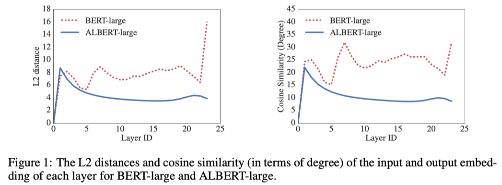
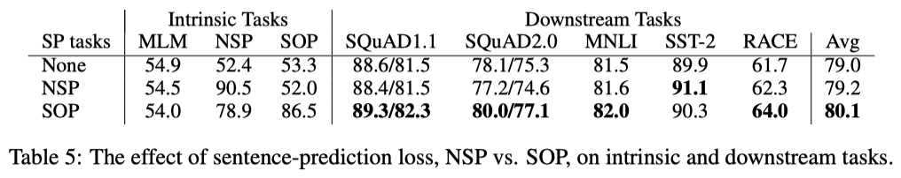

# ALBERT

在 2017 年 Transformer 的誕生，突破了 RNN、LSTM、GRU ... 等在計算上的限制，也帶來新的觀點，爾後再 2018 年底 **Google** 發表了 **BERT: Pre-training of Deep Bidirectional Transformers for Language Understanding** 開啟了通往偉大到航道的路線，也帶起了 pre-training model 的各種應用，不用再辛苦的從頭開始訓練，為了資料問題所苦惱。在 BERT 之後，湧出各種基於 BERT 的架構下進行優化改進，例如： GPT-2、XLNet、RoBERTa、ERNIE ... 等這些耳熟能詳的模型，而這次將是為大家介紹也是基於 BERT 的架構下 Google 在 2019 年推出的輕量化版本的 BERT，**ALBERT: A Lite BERT for Self-supervised Learning of Language Representations**。

## Introduction

如前言所述，在 BERT 後的時代透過大量的資料進行自監督(self-supervised[^1])的訓練，提高模型參數與更深層的結構，讓模型取得更好的表現，但也因為硬體上的限制，要訓練參數量大的模型就可能需要做到平行化處理以及記憶體內存的管控，但這樣的方式並沒有解決成本上的問題。基於這樣的情況，作者提出了下列問題：

<b> Is haveing better NLP models as easy as hvaing larger models?  </b>

也因為這個問題的討論，造就了 **A Lite BERT(ALBERT)** 的模型架構出來。

## Model architecture 

ALBERT 的模型架構與 BERT 相似，都是使用 transformer encoder 搭配 GELU nonlinearities 為主軸，但為了降低模型的參數並且獲得更好的表現，採用了兩種降低模型參數的方法與更換不同的預訓練任務，接下來將會一一介紹。

### Reduction techniques

ALBERT 採用了兩種減少參數的方法，解決在預訓練時模型擴展的問題，以下分別來解說採用的方法。

#### 1. Factorized embedding parameterization

在 BERT、XLNet、RoBERTa 中，都採用了 **WordPiece** 的方法，其 WordPiece embedding size $E$ 與 hidden layer size $H$ 是綁定在一起的，也就是說 size  大小一模一樣。這樣的方式對於模型來說是次優的辦法，而非最好的選擇，原因在於：

* WordPiece embedding 學習的是語句上下文相互獨立的表示方式
* Hidden-layer embedding 學習的是語句上下文有相關的表示方式

由於各別 embedding 在學習語句上的概念不同，所以作者在這邊進行了拆解，將原本 $E$ 與 $H$ 的 size 個別獨立，從 $ E \equiv H \rightarrow H \gg E $，這樣的拆解可以更有效優化模型的參數，也大幅降低了總參數量。因為如果採用原本的方式，綁定在一起，那麼當中提高 $H$ 的 size，那根據 vocabulary size $V$ 的大小(通常在一般的情況下 $V$ 是很大的，而在 BERT 中 $V$ 大約為 30,000)，WordPiece embedding  將會是 $V \times E$ 的矩陣大小，這樣是很容易得到一個有十億級別的模型參數，而且大部分的 embedding 在訓練期間都很少量的更新。

因此 ALBERT 對 WordPiece embedding 將行因式分解(factorization)，將其拆解成兩個小矩陣。先將 One-hot vector 投影到大小為 $E$ 的低維度空間中，然後再從低維度空間投影回 Hidden-layer embedding。模型在 embedding parameters 從原本的 $O\left(V \times H \right) \rightarrow O\left( V \times E + E \times H \right)$，大幅的降低模型的參數。

#### 2. Cross-layer parameter sharing

參數共享的這個想法，作者指出在 Transformer[^3] 時就有被拿來討論過，並使用在 encoder-decoder 的任務上而非是針對 pretraining/finetuning 的訓練上(這邊作者指的部分我認為應該是說 Embedding layer 與 pre-softmax linear transformation layer 的參數共享部分)。在 Dehghani et al. (2018)[^4] 所提出的 **Universal Transformer** 就展現了cross-layer parameter sharing 的方法在語言模型上得到更好的結果，在近年 Bai et al. (2019)[^5] 所提出的 **Deep Equilibrium Model (DQE)** 發現某一些層的 input embedding 與 output embedding 會達到一個平衡點(這邊平衡的解釋，需要去閱讀該篇 paper 才能比較了解，對此初步的了解認為在較深的 layer 時參數會達到一個平穩的狀態，不再震盪，達到收斂)。

參數共享的方法有很多種，比如說 only sharing  feed-forward network parameters、only sharing attention parameters 或是 sharing all parameters across layers ...等，在 ALBERT 中採用的是 sharing all parameters across layers。作者藉由計算向量相c似度的方法 L2 distances 與 cosine similarity 來衡量 input embedding 與 output embedding 在深層網路中是收斂還是震盪，如下圖：

<figure class="image"> 

  
  <figcaption>
  Image credit: <a href="https://arxiv.org/abs/1909.11942">Paper</a>
  </figcaption>

</figure>

透過圖的顯示，作者在這邊觀察到 embedding 在 BERT 中是呈現震盪變化，而採用 cross-layer parameter sharing 的 ALBERT 在深層網路中是逐漸平滑的趨勢，這樣的現象也告訴我們 weight-sharing 的方法對於穩定網路的參數有著顯著的影響。

在這部分作者也提到說，僅管的 BERT 相比，有明顯的下降震盪的狀況，但即使經過了 24 層，也不會收斂到 0 (也就是 input embedding 與 output embedding 完全相似)，對比前面提到得 DQE 所找到的解決方案有很大的不同。(這 DQE 感覺很神奇啊！需要好好來閱讀一番)

### Task change

BERT 的預訓練有兩個項目，一個是 masked language modeling (MLM)，另一項是 Next-sentence prediction (NSP)，在 ALBERT 的預訓練任務也參考了 BERT 的任務，採用了MLM 作為訓練任務之一，但另一項任務並非使用 NSP，而是採用了新的預訓練任務稱為 Sentence ordering objectives (SOP)，接下來將會解說兩者的差異，為什麼 ALBERT 要更換預訓練任務。

#### Sentence ordering objectives

* Next-sentence prediction (NSP)
  * 目的：學習語句之間的關係，預測第二個句子是否為上一個句的下一句，為一個二分類的訓練
  * Targets 產生的方式:
    * 是下一句(positive) $\rightarrow$ 同一文檔內的連續句子
    * 不是下一句(negative) $\rightarrow$ 不同文檔的句子組合
  * Positive 與 Negative 資料比例各站 50 %

* Sentence ordering objectives (SOP)
  * 目的：與 NSP 一樣，都是學習語句之間的關係，預測第二句子是否為上一句的下一句
  * Targets 產生的方式:
    * 是下一句(positive) $\rightarrow$ 同一文檔內的連續句子
    * 不是下一句(negative) $\rightarrow$ **同一文檔內的連續句子，但是順序對調**
  * Positive 與 Negative 資料比例各站 50 %

從上面的介紹可以明顯地發現兩個任務的差異在於 negative 樣本的創造方式，而為什麼要這樣去修改呢？

其實在 Liu et al., 2019[^6] 中就有提到 NSP 對於 downstream tasks 的表現會有影響，所以在 RoBERTa 的預訓練任務中將其剔除(這部分值得深讀一下 RoBERTa)。而作者在這邊認為在學習句子之間的關係是很注重 `語句的連貫性(coherence)與銜接性(cohesion)` ，假設說前一句與後一句所要描述的東西大不相同，那麼別說是機器，人類也很難理解想要表達的意思。

此外，NSP 的學習融合了兩個主軸，一個是 **topic prediction**，一個是 **coherence prediction**，由上述的 NSP 資料，其實可以了解到，在不同文檔的句子主組合會很容易學習到 topic prediction，因為所講的東西完全不同，但卻很難學習到 coherence prediction，而這樣的情況其實與 MLM 的學習有同疊到，所以作者認為語句組合的建構是語言理解中很重要的一部分，所以採用了 SOP，避免產生 topic prediction 的問題，專注於學習 inter-sentence coherence，並且也提出了基於 coherence 的 loss，**Inter-sentence coherence loss**。

下圖展示了在 `sentence-prediction loss` 的影響下，對於固有任務(Intrinsic Tasks)與下游任務(Downstream Tasks)的模型表現：

<figure class="image"> 

  
  <figcaption>
  Image credit: <a href="https://arxiv.org/abs/1909.11942">Paper</a>
  </figcaption>

</figure>

由上表可以看到在固有任務的表現，NSP 的訓練效果在 SOP 的預測上與隨機預測沒什麼差異，可以說是完全預測不出來，相反 SOP 的訓練下，在 NSP 的表現依然非常好(78.9% 的準確度)，由此可以確認 NSP 的任務學習只有對於 topic prediction 的部分有效。另外對於下游任務的表現也是基於 SOP 的訓練模型表現較好。

## Experimental Results

講解完 ALBERT 的主要優化與改變的地方後，接下來看看作者對於 ALBERT 與其他模型的各種實驗比較。

## Conclusion

## Reference

[^1]: Self Supervised Representation Learning in NLP, Amit Chaudhary, https://amitness.com/2020/05/self-supervised-learning-nlp/

[^2]: Dan Hendrycks and Kevin Gimpel., Gaussian Error Linear Units (GELUs)., arXiv preprint arXiv:1606.08415, 2016. 
[^3]: Ashish Vaswani, Noam Shazeer, Niki Parmar, Jakob Uszkoreit, Llion Jones, Aidan N Gomez, Łukasz Kaiser, and Illia Polosukhin. Attention is all you need. 2017
[^4]: Mostafa Dehghani, Stephan Gouws, Oriol Vinyals, Jakob Uszkoreit, and Łukasz Kaiser. Universal transformers. arXiv preprint arXiv:1807.03819, 2018.
[^5]: Shaojie Bai, J. Zico Kolter, and Vladlen Koltun. Deep equilibrium models. In Neural Information Processing Systems (NeurIPS), 2019.
[^6]: Yinhan Liu, Myle Ott, Naman Goyal, Jingfei Du, Mandar Joshi, Danqi Chen, Omer Levy, Mike Lewis, Luke Zettlemoyer, and Veselin Stoyanov. RoBERTa: A robustly optimized BERT pretraining approach. arXiv preprint arXiv:1907.11692, 2019.
[^7]: Zhilin Yang, Zihang Dai, Yiming Yang, Jaime Carbonell, Ruslan Salakhutdinov, and Quoc V Le. XLNet: Generalized autoregressive pretraining for language understanding. arXiv preprint arXiv:1906.08237, 2019.

