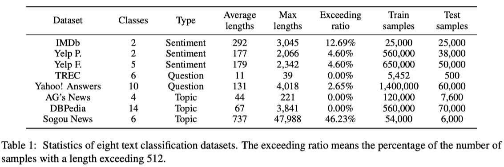
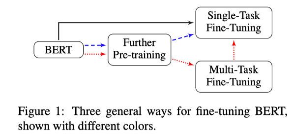

This paper is inversgate the different tuning strategies for pre-training model at appliaction side. 

This paper reveiwed two related approach: `language model pre-training` and `multi-task learning`.

* Language model pre-training: We know BERT[^1] is pre-training on ***Masked Language Model Task*** and  ***Next Sentence Prediction Task*** via the larger cross-domain corpus to imporve the downstream task.
* Multi-task learning: The method is training the language model and the main task model jointly.

​	

At final layer add softmax layer to the top of BERT and to predict the probability of label c:
$$
p(c|h) = softmax(Wh)
$$
where $W$ is the task-specific parameter matrix.

We could imagines $W$ is a jointly by maximizing the log-probability of the correct label.

## Datasets

In this paper use eight wiedely-sudied datasets. Base on the target  of different datasets there have three classification tasks.

* Sentiment analysis classifcation
* Question classification
* Topic classification

<figure class="image"> 

  
  <figcaption>
  Image credit: <a href="https://arxiv.org/abs/1905.05583">Paper</a>
  </figcaption>

</figure>

## Methods

In the paper the authors had two topic to discuss:

* Propose fine-tune the pre-trained BERT strategies.
  1. Further pre-train BERT on **within-task** training data or **in-domain** data.
  2. Fine-tune BERT with multi-task learning.
  3. Fine-tune BERT for the target task.

* Investigate the fine-tune methods for BERT on several sides.
  1. Pre-process of long text
  2. Layer selection
  3. Layer wise learning rate.
  4. Catastrophi forgetting.
  5. Low-shot learning problems.

### 1. Fine-Tuning Strategies

Before to discusse the fine-tuning strategies there have serveral factores need consideration:

1. Long text processing: The maximum sequence length of BERT  is 512. The paper used truncation methods to handle the long text problem. There were three method try to dealing with:

   1. **Head-only**: keep the first 510 tokens.
   2. **Tail-only**: keep the last 510 tokens.

   3. **Head + tail**: empirically select the first 128 and the last 382 tokens.

2. Layer selection: The official BERT-base model is builded by 12 encoder lyers. We need to chose which layer is more effective layer for text classification task.

3. Overcome overfitting problem.

Intuitively, the lower layer may contain more geneal information and the higher layer may extracte specific feature information for task. So, we can fine-tun them with differenct learning rates.

Following **Howard and Ruder (2018)**[^2] , the authors to split the parameters $\theta$ into $ \{\theta^1, \dots, \theta^L\}$ where the $\theta$ contatins the parameters of the $l$-th layer of BERT.
$$
\theta_t^l = \theta_{t-1}^l - \eta^L \nabla_{\theta^l}J(\theta)
$$
where $\eta^l$ represents the learning rate of the $l$-th layer.

We set the base learning rate to $\eta^l$ and use the decay factor $\xi$ to set different learning rate $\eta^{k-1} = \xi\cdot\eta^k$ in different layers. When $\xi < 1$ the lower layers will have the lower learning rate than higher layers. When $\xi = 1$ , all layers have the same learning rate.

### 2. Further Pre-training

### 3. Mulit-Task Fine-Tuning

On below figure is differnet fine-tuning strategiess for BERT.

1. Fine-tuning with single task.
2. Further pre-training and fine-tuning with single task.
3. Training with pre-training and multi-task learning and then fine-tuning with single task.

<figure class="image"> 

  
  <figcaption>
  Image credit: <a href="https://arxiv.org/abs/1905.05583">Paper</a>
  </figcaption>

</figure>

## Reference

[^1]: Jacob Devlin, Ming-Wei Chang, Kenton Lee, and Kristina Toutanova. 2018. Bert: Pre-training of deep bidirectional transformers for language understanding. arXiv preprint arXiv:1810.04805.
[^2]: Jeremy Howard and Sebastian Ruder. 2018. Universal language model fine-tuning for text classification. arXiv preprint arXiv:1801.06146.

